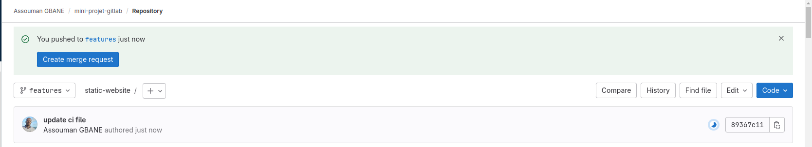
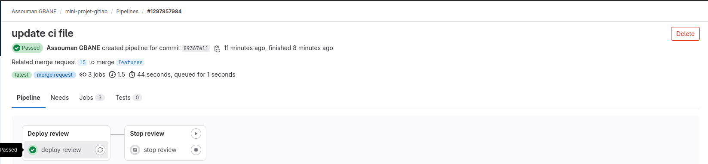
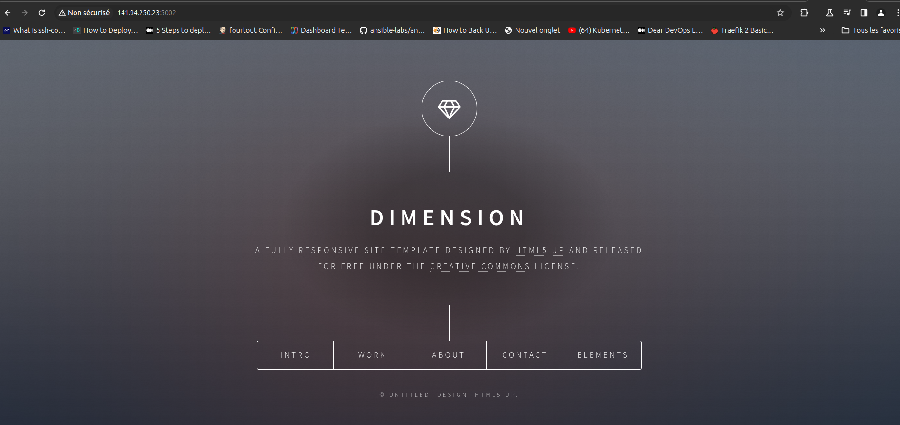
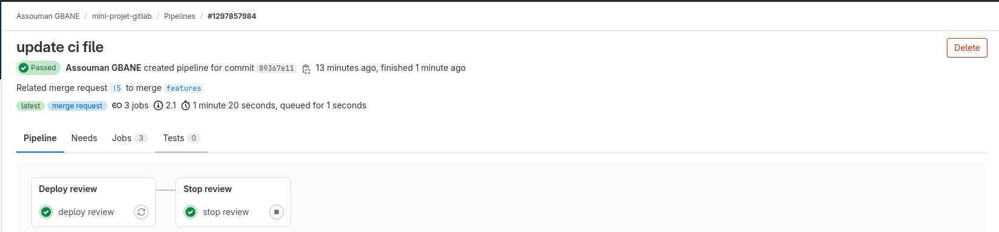
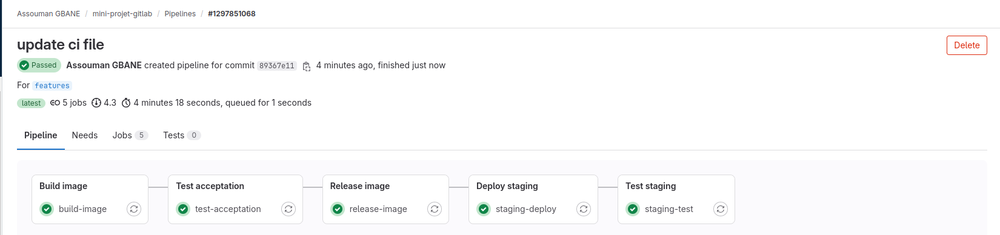
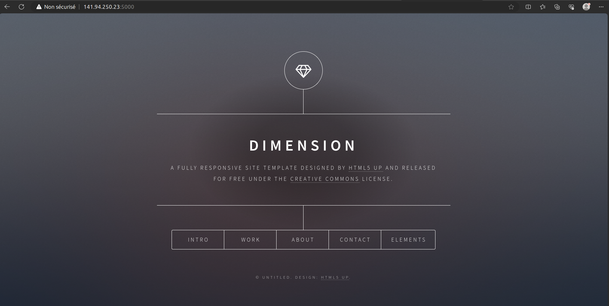
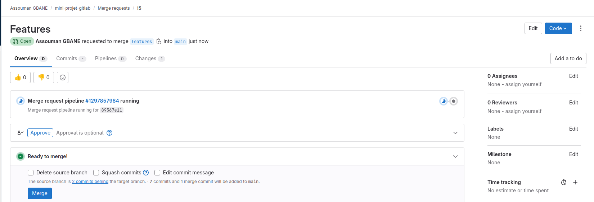
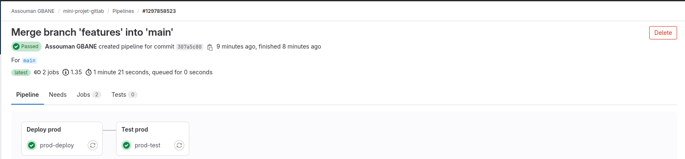
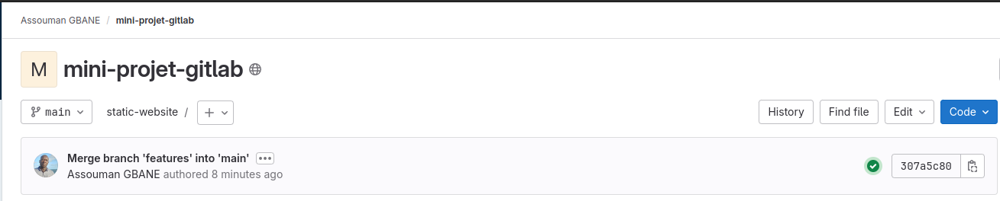
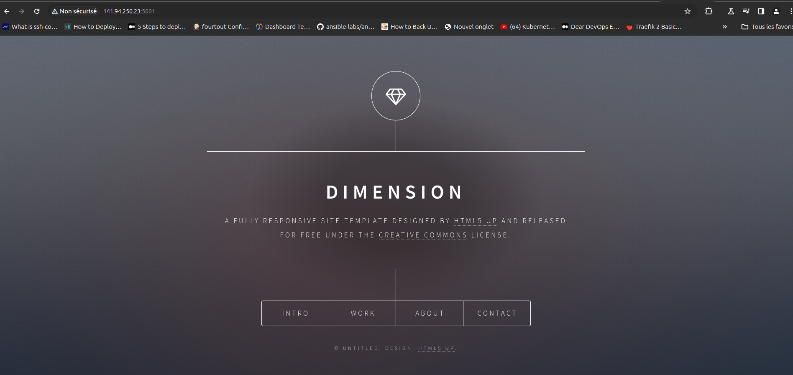

# Mini Project gitlab 

Ce Project a pour objectif de valider les aspects théoriques et techniques acquis sur le module **gitlab** durant le Bootcamp Devops promo .

--------------------------------------------
## Objectif
Mettre en place un pipeline CI/CD qui permettra de deployer un site web en ligne en passant par les différentes étapes de mise en production.

[code source](https://github.com/diranetafen/static-website-example)

## Bésoins
- Un VPS dans le cloud (OVH)
- Installer Docker 
- Cloner le code source 
- Mise en place du pipeline CI/CD

## Plan de Travail
- 1 - Mise en place du VPS 
- 2 - Installation de Docker 
- 3 - Mise en place du pipeline
- 4 - Exécution du pipeline

### 1 - Mise en place du VPS
**Exigences:**
- accèss à OVHcloud Control Panel
- créer un VPS dans le panel de OVHcloud
- identifiants de connexion reçus par e-mail après l'installation

### 2 - Installation de Docker
- **a. Configuration du dépôt `apt` de Docker.**
```
# Add Docker's official GPG key:
sudo apt-get update
sudo apt-get install ca-certificates curl
sudo install -m 0755 -d /etc/apt/keyrings
sudo curl -fsSL https://download.docker.com/linux/debian/gpg -o /etc/apt/keyrings/docker.asc
sudo chmod a+r /etc/apt/keyrings/docker.asc

# Add the repository to Apt sources:
echo \
  "deb [arch=$(dpkg --print-architecture) signed-by=/etc/apt/keyrings/docker.asc] https://download.docker.com/linux/debian \
  $(. /etc/os-release && echo "$VERSION_CODENAME") stable" | \
  sudo tee /etc/apt/sources.list.d/docker.list > /dev/null
sudo apt-get update
```
- **b. Pour installer la dernière version, exécutez :**
```
sudo apt-get install docker-ce docker-ce-cli containerd.io docker-buildx-plugin docker-compose-plugin
```
- **c. Ajoutez l'utilisateur au groupe Docker**
```
sudo usermod -aG docker $USER
```

- **d. Vérification**
```
sudo systemctl status docker
```

```
● docker.service - Docker Application Container Engine
     Loaded: loaded (/lib/systemd/system/docker.service; enabled; vendor preset: enabled)
     Active: active (running) since Mon 2024-05-20 08:59:39 UTC; 1h 23min ago
TriggeredBy: ● docker.socket
       Docs: https://docs.docker.com
   Main PID: 782 (dockerd)
      Tasks: 18
     Memory: 145.2M
        CPU: 3.056s
     CGroup: /system.slice/docker.service
             ├─ 782 /usr/sbin/dockerd -H fd:// --containerd=/run/containerd/containerd.sock
```

### 3 - Mise en Place du pipeline

- **a. Création du fichier .gitlab-ci.yml**
Procédons à la Création du fichier ``.gitlab-ci.yml`` à la racine de notre projet. Il s’agit du fichier qui va déterminer les tâches à automatiser par **GitLab CI**.

```
touch static-website/.gitlab-ci.yml
```

- **b. Création des variables**
Nous allons ajouter 12 variables qui seront nécessaires à notre objectif. Bien que certains d'entre elles puissent être codées en dur dans notre fichier .gitlab-ci.yml, nous les utiliserons afin de profiter de la réutilisabilité dans le pipeline. Ces variables sont:

| **Variables**                | **Description**                                      |
|------------------------------|------------------------------------------------------|
| **DEPLOY_USER**              | L'utilisateur utilisé pour le déploiement            |
| **PORT**                     | Le Port d'écoute du serveur SSH                      |
| **PROD_IP**                  | L' Adresse IP du serveur de prod                     |
| **REVIEW_IP**                | L'URL de la review                                   |
| **SSH_PRIVATE_KEY**          | la clé de connexion ssh                              |
| **STAGING_IP**               | L' Adresse IP du serveur de staging                  |
| **CI_REGISTRY**              | le registre de gitlab                                |
| **DOCKER_HUB_TOKEN**         | le token de connexion à docker hub                   |
| **DOCKER_REGISTRY**          | docker hub                                           |
| **DOCKER_HUB_USER**          | l'utilisateur pour la connexion à docker hub         |
| **IMAGE_NAME**               | l'image du site                                      |
| **WORKPACE**                 | l'identifiant Docker Hub                             |


- **c. Création des variables d'environnement**
Pour éviter de coder en dur dans le pipeline on va déclarer globalement des variables d'environnment qui seront utilisées dans nos stages.

```
variables:
  APP_NAME: website
  PROD_NAME: prod-${APP_NAME}
  STG_NAME: staging-${APP_NAME}
  REVIEW_APP_NAME: website-${CI_COMMIT_REF_NAME}
  REVIEW_APP_ENDPOINT: ${REVIEW_IP}:${REVIEW_EXTERNAL_PORT}
  STG_APP_ENDPOINT: ${STAGING_IP}:${STG_EXTERNAL_PORT}
  PROD_APP_ENDPOINT: ${PROD_IP}:${PROD_EXTERNAL_PORT}
  INTERNAL_PORT: 80
  EXTERNAL_PORT: 80
  STG_EXTERNAL_PORT: 5000
  PROD_EXTERNAL_PORT: 5001
  REVIEW_EXTERNAL_PORT: 5002
```
**Description:**

- **APP_NAME:** le nom du conteneur 
- **PROD_NAME:** le nom du conteneur de prod
- **STG_NAME:**  le nom du conteneur de staging
- **REVIEW_APP_NAME:**  le nom du conteneur de review
- **REVIEW_APP_ENDPOINT:** l'url de la review
- **STG_APP_ENDPOINT:** l'url de staging
- **PROD_APP_ENDPOINT:** l'url de la prod
- **INTERNAL_PORT:** le port interne des conteneurs
- **EXTERNAL_PORT:** le port mappé à celui du conteneur
- **STG_EXTERNAL_PORT:**  le port externe mappé au conteneur de staging
- **PROD_EXTERNAL_PORT:**  le port externe mappé au conteneur de prod
- **REVIEW_EXTERNAL_PORT:** le port externe mappé au conteneur de review

- **Définition de l'image de base de notre pipeline**
On défini `docker:latest` comme notre image de base qui servira d'environnement d'exécution de notre pipeline et ajouté un service `docker:dind` **« *Docker-in-Docker* »** qui permettra l'exécution des commandes Docker dans l'environnement.

```
image: docker:latest
services:
  - name: docker:dind
    alias: docker
```
- **d. Les différents Stages**
```
stages:
  - Build image
  - Test acceptation
  - Release image
  - Deploy review
  - Stop review
  - Deploy staging
  - Test staging  
  - Deploy prod
  - Test prod
```
Notre pipeline comportera **09 Stages** qui sont décris dans le tableau ci-dessous:

| **Stages**            | **Description**                                                  |
|-----------------------|------------------------------------------------------------------|
| **Build image**       | construction de notre image                                      |
| **Test acceptation**  | test de l'image en créant un conteneur                           |
| **Release image**     | push l'image vers nos deux registres (gitlab et docker hub)      |
| **Deploy review**     | Déploiement de la review                                         |
| **Stop review**       | Arrêt de la review                                               |
| **Deploy staging**    | déploiement du site en environnement de staging                  |
| **Test staging**      | test du site en environnment de staging                          |
| **Deploy prod**       | Déploiement du site dans l'environnement de la Prod              |
| **Test prod**         | Test du site en environnement de prod                            |

- **e. Template pour tester le site**

Nous allons créer un `hidden job` comme template qui sera réutilisé  dans d'autres `Stages` avec l'argument `extends` on peut aussi utiliser des ancres YAML `Anchors` tels que `<<` ,`&` et `*` pour étendre les autres stages.

```
.test_template: &test
  image: alpine
  script:
    - apk --no-cache add curl
    - curl -k "http://$DOMAIN" | grep -i "DIMENSION"
```
- **f. Template de connexion SSH**
Ce `hidden job` va nous permettre de faire de la repétition dans d'autres stages    
```
.ssh_template: &ssh
  before_script:
    - command -v ssh-agent > /dev/null || (apk add --update openssh)
    - eval $(ssh-agent -s)
    - echo "$SSH_PRIVATE_KEY"|tr -d '\r'| ssh-add -
    - mkdir -p ~/.ssh
    - chmod 700 ~/.ssh
    - echo -e "Host *\n\tStrictHostKeyChecking no\n\n" > ~/.ssh/config
    - apk add --no-cache curl
```
**g. Build de l'image**

```
build-image:
  stage: Build image
  script:
    - docker build -t website-static .
    - docker save website-static > website-static.tar
  artifacts:
    paths:
      - website-static.tar
```
Ce stage va permettre de construire l'image et de la sauvegarder en fichier **tar** pour ensuite la rendre disponible aux autres stages avec l'argument' `artifacts`.

**h. Test de l'image**

Nous pouvons maintenant tester notre image en créant un conteneur. 
bien avant on installe `curl`.
```
test-acceptation:
  stage: Test acceptation
  script:
    - docker load -i website-static.tar
    - docker stop website-static || true && docker rm website-static || true
    - docker run --name site -d -p $EXTERNAL_PORT:$INTERNAL_PORT website-static
    - apk add --no-cache curl
    - sleep 5
    - curl http://docker
```
**i. Release de l'image**

Après avoir tester et valider notre image on peut maintenant la pousser sur nos 02 registres `gitlab container registry` et `docker hub`.
```
release-image:
  stage: Release image
  script:
    - docker load -i website-static.tar
    - docker tag website-static "${IMAGE_NAME}:${CI_COMMIT_REF_NAME}"
    - docker tag website-static "${IMAGE_NAME}:${CI_COMMIT_SHORT_SHA}"
    - docker login -u ${CI_REGISTRY_USER} -p ${CI_REGISTRY_PASSWORD} ${CI_REGISTRY}
    - docker push "${IMAGE_NAME}:${CI_COMMIT_REF_NAME}"
    - docker push "${IMAGE_NAME}:${CI_COMMIT_SHORT_SHA}"
```
**j. Déploiement de la review**
La review permet de tester le site avant son déploiement en staging
```
deploy review:
  stage: Deploy review
  environment:
    name: review/$CI_COMMIT_REF_NAME
    url: http://${REVIEW_APP_ENDPOINT}
    on_stop: stop review
  only:
    - merge_requests
  variables:
    APP_NAME: ${REVIEW_APP_NAME}
  <<: *ssh
  script:
    - sleep 5
    - ssh -T -p ${PORT} -l ${DEPLOY_USER} ${STAGING_IP} "docker run --name ${APP_NAME} -d -p $REVIEW_EXTERNAL_PORT:$INTERNAL_PORT "${IMAGE_NAME}:${CI_COMMIT_REF_NAME}""
    - curl "http://${REVIEW_APP_ENDPOINT}"
```
>NB: La review ne se fera qu'en cas de `merge_requests`

**k. Arrêt de la review**

```
stop review:
  stage: Stop review
  variables:
    GIT_STRATEGY: none
    APP_NAME: ${REVIEW_APP_NAME}
  environment:
    name: review/$CI_COMMIT_REF_NAME
    action: stop
  only:
    - merge_requests
  when: manual  
  script:
    - apk --no-cache add curl
    - echo "delete"
```
**l. Déploiement en staging**

Nous allons créer une nouvelle branche nommée `features`. Cette branche sera dédiée à l'environnement de staging et la branche `main` à la prod et permettra d'isoler les changements, tester et valider les nouvelles fonctionnalités avant de les intégrer à la branche principale `main` donc avant de les passer en production

étapes à suivre : 

- **Code > Branches > New branch : features > Create from main**

à partir de maintenant on va ajouter les `arguments` ci-dessous aux stages de staging et de prod

**m. Stages de staging**
```
only:
  - features
```
**n. Stages de prod**
```
only:
  - main
```
Ce stage fait appel au `hidden_job` de connexion ssh pour se connecter au serveur de staging et deploy le site.
NB: Seul la branche `features` est deployé en staging .
```
staging-deploy:
  stage: Deploy staging
  only:
    - features
  environment:
    name: staging
    url: http://$STG_APP_ENDPOINT
  <<: *ssh
  script:
    - sleep 5
    - echo "deploying to staging"
    - ssh -T -p ${PORT} -l ${DEPLOY_USER} ${STAGING_IP} "docker pull "${IMAGE_NAME}:${CI_COMMIT_REF_NAME}";docker stop ${APP_NAME} || true && docker rm ${APP_NAME} || true;docker run --name ${APP_NAME} -d -p ${STG_EXTERNAL_PORT}:${INTERNAL_PORT} "${IMAGE_NAME}:${CI_COMMIT_REF_NAME}";docker rmi -f ${APP_NAME}"
```

**o. Test du site en staging**

Nous pouvons tester le site en environment de staging en appelant le `hidden_job` ` &test` 

```
staging-test:
  <<: *test
  stage: Test staging
  only:
  - features
  variables:
    DOMAIN: ${STG_APP_ENDPOINT}
```


**p. Déploiement en Prod**

Ce stage fait appel au `hidden_job` de connexion ssh pour se connecter au serveur de prod et deploy le site.
NB: Seul la branche `main` est deployé en prod .

```
prod-deploy:
  stage: Deploy prod
  only:
    - main
  environment:
    name: prod
    url: http://$PROD_APP_ENDPOINT
  <<: *ssh
  script:
    - sleep 5
    - ssh -T -p ${PORT} -l ${DEPLOY_USER} ${PROD_IP} "docker stop ${PROD_NAME} || true && docker rm ${PROD_NAME} || true; docker run --name ${PROD_NAME} -d -p ${PROD_EXTERNAL_PORT}:${INTERNAL_PORT} "${IMAGE_NAME}:${CI_COMMIT_REF_NAME}""
```

**q. Test du site en prod**

Nous pouvons tester le site en environment de production en appelant le `hidden_job` ` &test` 

```
prod-test:
  <<: *test
  stage: Test prod
  only:
    - main 
  variables:
    DOMAIN: ${PROD_APP_ENDPOINT}
```

### Exécution du pipeline
Pour le déclencher le pipeline il faut faire un `commit` suivi d'un push sur la branche `features`

```
git add .
git commit -m "Update Readme"
```

```
[features e778d58] Update Readme
 2 files changed, 371 insertions(+), 13 deletions(-)
 create mode 100644 images/ovh.png
```

```
git push origin features
```

```
Énumération des objets: 8, fait.
Décompte des objets: 100% (8/8), fait.
Compression par delta en utilisant jusqu'à 12 fils d'exécution
Compression des objets: 100% (5/5), fait.
Écriture des objets: 100% (5/5), 24.38 Kio | 24.38 Mio/s, fait.
Total 5 (delta 2), réutilisés 0 (delta 0), réutilisés du pack 0
remote: 
remote: To create a merge request for features, visit:
remote:   https://gitlab.com/gbane.assouman/static-website/-/merge_requests/new?merge_request%5Bsource_branch%5D=features
remote: 
To https://gitlab.com/gbane.assouman/static-website.git
   2805c7a..e778d58  features -> features
```

**Notification de la Merge request**
----


**Déploiement de la Review**
-----


**Test de la review**
-----


**Arrêt de la Review**
-----


**Déploiement de la Staging**
-----


**Test de la staging**
-----


**Merge de la branche feature vers la main**
-----


**Déploiement de la Prod**
-----

-----


**Test de la Prod**
-----

-----


```
docker ps
```

```
CONTAINER ID   IMAGE                                                        COMMAND                  CREATED          STATUS          PORTS                              NAMES
57387904976e   registry.gitlab.com/gbane.assouman/static-website:features   "/docker-entrypoint.…"   9 minutes ago    Up 9 minutes    0.0.0.0:5002->80/tcp               website-features
29e2adb9b893   registry.gitlab.com/gbane.assouman/static-website:main       "/docker-entrypoint.…"   10 minutes ago   Up 10 minutes   0.0.0.0:5001->80/tcp               prod-webapp

```

## Conclusion
En mettant en place ce pipeline CI/CD pour l'application web statique, j'ai pu automatiser les processus de construction, de test et de déploiement, tout en garantissant que l'application est correctement testée et fonctionnelle avant d'être mise en production. L'utilisation de Docker et de GitLab CI/CD a facilité la gestion des environnements et des déploiements, offrant un moyen efficace et fiable de mettre à jour et de maintenir l'application.