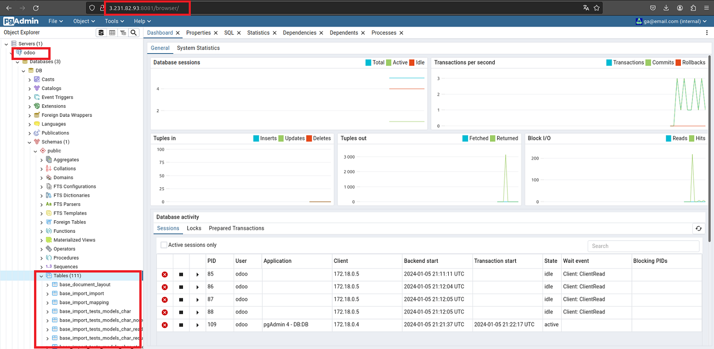

# PROJET FINAL DEVOPS


**Le Projet fil rouge** est mon projet de fin de formation Devops.
Son objectif est de faire la démonstration pratique et théorique des éléments techniques appris durant le cursus DevOps à savoir **Docker, gitlab-ci, jenkins, Terraform, Ansible et Kubernetes**

# Table des Matières

- [**PROJET FINAL DEVOPS.**](#projet-final-devops)
  - [**INTRODUCTION**](#introduction)
      - [odoo](#odoo)
      - [pgadmin](#pgadmin)
      - [Liens utiles](#liens-utiles)
  - [**PARTIE 1: Conteneurisation de l’application web**](#partie-1-conteneurisation-de-lapplication-web)
    - [a. Création du projet fil rouge](#a-création-du-projet-fil-rouge)
    - [b. Écriture du Dockerfile](#b-ecriture-du-dockerfile)
    - [c. Build et Test](#c-build-et-test)
    - [d. Push vers DockerHub](#d-push-vers-dockerhub)
  - [**PARTIE 2: Mise en place d'un pipeline CI/CD à l'aide de Gitlab-CI et Terraform**](#partie-2-mise-en-place-dun-pipeline-cicd-à-laide-de-gitlab-ci-et-terraform)
    - [a - Mise en place de notre infrastructure](#a-mise-en-place-de-notre-infrastructure)
    - [b - Mise en place du pipeline](#b-mise-en-place-du-pipeline)
    - [c - Customisation de la conteneurisation](#c-customisation-de-la-conteneurisation)
  - [**PARTIE 3: Déploiement des différentes applications dans un cluster Kubernetes**](#partie-3-déploiement-des-différentes-applications-dans-un-cluster-kubernetes)
    - [a - Architecture](#a-architecture)
    - [b - Identification des Ressources](#b-identification-des-ressources)
    - [c - Installation de Kubernetes](#c-installation-de-kubernetes)
    - [d - Mise en place du pipeline CI/CD ](#d-mise-en-place-du-pipeline-cicd)
  - [**CONCLUSION**](#conclusion)

## INTRODUCTION 

La société **IC GROUP** dans laquelle vous travaillez en tant qu’ingénieur Devops souhaite mettre sur pied un **site web vitrine** devant permettre d’accéder à ses 02 applications phares qui sont :  

1. Odoo 
2. pgAdmin 
#### odoo

Odoo est distribué en version communautaire et Enterprise. ICGROUP souhaite avoir la main sur le code et apporter ses propres modifications et customisations. Ainsi, l'entreprise a opté pour l’édition communautaire.  Plusieurs versions de Odoo sont disponibles et celle retenue est la version ``13.0``, car elle intègre un système de LMS (Learning Management System) qui sera utilisé pour publier les formations en internes et ainsi diffuser plus facilement l’information.  

#### pgadmin
**pgAdmin** devra être utilisée pour administrer de façon graphique la base de données PostgreSQL, qui est un composant essentiel au fonctionnement de odoo. 
Le site web vitrine a été conçu par l’équipe de développeurs de l’entreprise et les fichiers y relatifs se trouvent dans le repo suivant: [ https://github.com/sadofrazer/ic-webapp.git ](https://github.com/sadofrazer/ic-webapp.git). Il est de votre responsabilité de conteneuriser cette application tout en permettant la saisie des différentes URL des applications (Odoo et pgadmin) par le biais des variables d’environnement. 

Ci-dessous un aperçu du site vitrine attendu. 


----

**NB:** L’image créée devra permettre de lancer un conteneur permettant d’héberger ce site web et ayant les liens adéquats permettant d’accéder aux applications internes.

# PARTIE 1: Conteneurisation de l’application web
Voici les étapes à suivre pour la conteneurisation de cette application:

1) L'image de base sera ```python:3.6-alpine```
2) Définir le répertoire `/opt` comme répertoire de travail 
3) Installer le module Flask version 1.1.2 à l’aide de `pip install flask==1.1.2`
4) Exposer le port `8080` qui est celui utilisé par défaut par l'application
5) Créer les variables d’environnement `ODOO_URL` et `PGADMIN_URL` afin de permettre la définition des url applicatives lors du lancement du conteneur
6) Lancer l’application `app.py` dans le `ENTRYPOINT` grâce à la commande `python`

Une fois le Dockerfile crée, buildez l'image et lancer un conteneur de test permettant d’aller sur les sites web officiels de chacune de ces applications ( les sites web officiels sont fournis ci-dessus). 

### Nom de l'artefact et registre utilisé
Une fois le test terminé, supprimez le conteneur de test et poussez votre image sur votre registre Docker hub. L'image finale devra se nommer comme suit:

- **Nom:**  ``ic-webapp``   
- **Tag:** ``1.0``  
- **Nom du conteneur de test:** ``test-ic-webapp``

### a. Création du Projet fil rouge

Nous allons commencer par la création du Projet sur **gitlab** pour ensuite le cloner localement.
Pour cela il faut suivre ces étapes: **+** -> **New projet/repository** -> **Create blank project** et renseigner les informations demandées.


---
- clonage du projet en local
```
git clone https://gitlab.com/gbane.assouman/projet-fil-rouge.git
```
```
cd projet-fil-rouge && mkdir -p sources
```
Le dossier `sources` est le dossier qui va contenir l'ensemble des codes

### b. Écriture du Dockerfile 
- Création du Dockerfile
```
projet-fil-rouge$ touch sources/Dockerfile 
```

```
FROM python:3.6-alpine
LABEL maintener="GBANE Assouman"
LABEL email="gbane.assouman@gmail.com"
WORKDIR /opt
RUN pip install flask==1.1.2
COPY ./app/ /opt/
EXPOSE 8080
ENV ODOO_URL='https://www.odoo.com/'
ENV PGADMIN_URL='https://www.pgadmin.org/'
ENTRYPOINT ["python","app.py"]
```
*NB: Le code source a été rassemblé dans le dossier **app***
### c. Build et Test

- Build
```
docker build -t ic-webapp:1.0 .

```
```
docker run --name test-ic-webapp -d -p 4444:8080 ic-webapp:1.0 
2033634663fe21cfa71557b2b16a2dd5efc8828e5cbe1adfede40cc78fd9927c
```
```
docker ps -a|grep -i "test-ic-webapp"
2033634663fe   ic-webapp:1.0                       "python app.py"          12 seconds ago      Up 11 seconds                   0.0.0.0:4444->8080/tcp, :::4444->8080/tcp              test-ic-webapp
```
- Test 


---

### d. Push vers Dockerhub
- Procédons d'abord à l'arrêt puis à la supression du conteneur
```
docker stop test-ic-webapp 
test-ic-webap
```
```
docker rm test-ic-webapp 
test-ic-webapp
```
```
docker tag ic-webapp:1.0 openlab89/ic-webapp:1.0
```
```
docker push openlab89/ic-webapp:1.0 
The push refers to repository [docker.io/openlab89/ic-webapp]
cb85cd2e3be1: Pushed 
81c97900e352: Pushed 
3156423bd38f: Mounted from library/python 
efa76becf38b: Mounted from library/python 
671e3248113c: Mounted from library/python 
1965cfbef2ab: Mounted from library/python 
8d3ac3489996: Mounted from library/python 
1.0: digest: sha256:b18bc5973a28538507f2cdc494f0e15ec905faed6f4ea672c54f33b5acfc22f9 size: 1789
```
- **Résultat**


---
# PARTIE 2: Mise en place d'un pipeline CI/CD à l'aide de Gitlab-CI et Terraform


---

## a. Mise en place de notre infrastructure
Pour cette partie, on aura besoin de 3 serveurs hébergés dans le cloud de `AWS`, dont les rôles seront les suivants:

  1) **Serveur 1**, ``(AWS, t2.medium)``: Runner Gitlab-CI
  2) **Serveur 2**, ``(AWS, t2.micro)`` : Serveur de STAGING 
  3) **Serveur 3**, ``(AWS, t2.micro)`` : Serveur de PROD 

Le choix du cloud provider importe peu (AWS, AZURE ou autres ...)
> :warning: Le serveur 1 (**Runner Gitlab-CI**) sera créé manuellement par vos soins pour les besoins de CI. Il devra être rataché à votre compte Gitlab pour en faire votre Runner privé. Quant aux deux autres, il seront créé automatiquement par le pipeline, via l'outil `terraform`.

>NB: Pour des raisons de performances constatées lors des déploiements nous allons utilser des instances `t2.medium`

### a.1 - Structuration du code terraform 
Dans le but de dynamiser notre déploiement nous allons écrire un module `terraform` pour la création de nos serveurs de `staging` et de `prod`.

Quant au `runner` son deploiement se fera indépendamment du module mais avec un autre script `terraform`.

Ce module aura les caractéristiques suivantes:
- **image**: `ubuntu-bionic-18.04`
- **région**: `us-east-1`
- il sera attachée à une `ebs`, une ip publique `eip` et security group `sg`

Nous allons aussi créer 02 dossiers qui vont utiliser le module pour déployer les instances, ces dossiers sont:
- `staging` : pour l'instance de staging
- `prod` : pour l'instances de prod


### a.2 - Écriture des modules

Procédons à la création du module ec2module.
```
mkdir -p terraform/{files,modules,staging,prod,runner}
mkdir -p terraform/modules/ec2module
touch main.tf outputs.tf variables.tf backend.tf
cp main.tf outputs.tf variables.tf modules/ec2module/
cp main.tf variables.tf backend.tf staging/
cp main.tf variables.tf backend.tf prod/
mv variables.tf main.tf outputs.tf runner/
```

### Structure des modules
```
.
├── files
│   └── devops-gbane.pem
├── modules
│   └── ec2module
│       ├── main.tf
│       ├── outputs.tf
│       └── variables.tf
├── prod
│   ├── backend.tf
│   ├── main.tf
│   └── variables.tf
└── staging
    ├── backend.tf
    ├── main.tf
    └── variables.tf

6 directories, 12 files
```
### Rôles des dossiers et fichiers
- ```staging``` : le module de staging, il fera appel au module ec2module , c'est aussi dans ce dossier que les commandes **terraform** pour la création du serveur de staging seront executées.
- `prod` : le module de prod, c'est aussi dans ce dossier que les commandes **terraform** pour la création du serveur de prod seront executées.

- `modules/ec2module` : module de l'instance `ec2` c'est ici que seront définies les informations sur l'instance

- `main.tf` : contiendra la configuration principale de nos modules ainsi que les variables à surcharger
- `outputs.tf` : contient les valeurs de sortie ,il expose des informations que d'autres configurations `Terraform` peuvent utiliser. 

- `variables.tf` : contiendra les valeurs  de variables des modules. Lorsqu'un module est utilisé par d'autres, les variables seront configurées comme arguments dans le bloc `module`. 

- `backend.tf` : Terraform doit stocker l'état de l'infrastructure et des configurations. Cet  état est utilisé par Terraform pour mapper les ressources du monde réel à la configuration, suivre les métadonnées et améliorer les performances de l' infrastructure. Cet état est stocké par défaut dans un fichier local nommé `« terraform.tfstate »`, mais il est recommandé de le stocker dans le Cloud pour le versionner, le chiffrer et le partager en toute sécurité avec d'autres personnes.

## Écriture des modules

###  1 - Le module ec2module
Éditons nos 03 scripts `main.tf`, `outputs.tf` et `variables.tf` qui se trouvent dans le répertoire **ec2module**

```
├── ec2module
│   ├── main.tf
│   ├── outputs.tf
│   └── variables.tf
```
**1.a - modules/ec2module/main.tf**

Dans ce fichier nous allons déclarer une **data source** `data` et 03 `resources`.

- la `data` source va définir l'image à utiliser pour installer nos instances.
- les `resources` vont definir le type d'instance `ec2`, l'ip publique `eip` et la security group `sg` avec les ports à ouvrir.

>NB: On aurait pu créer un module pour chaque resources (`ec2`, `eip` et `sg`) et les appeler comme le module `ec2module`

- contenu du script main.tf
```
data "aws_ami" "app_ami" {
  most_recent = true
  owners      = ["099720109477"] # Canonical
  filter {
    name   = "name"
    values = ["ubuntu/images/hvm-ssd/ubuntu-bionic-18.04-amd64-server-*"]
  }
  filter {
    name   = "virtualization-type"
    values = ["hvm"]
  }
}

resource "aws_instance" "projet_fil_rouge" {
  ami             = data.aws_ami.app_ami.id
  instance_type   = var.instancetype
  key_name        = var.aws_key_name
  tags            = var.aws_common_tag
  security_groups = ["${var.aws_sg_name}"]
  
  root_block_device {
    delete_on_termination = true
  }
}

resource "aws_eip" "lb" {
  instance = aws_instance.projet_fil_rouge.id
  domain   = "vpc"
  tags = var.aws_eip_tag
  provisioner "local-exec" {
    command =  "echo ${aws_eip.lb.public_ip} >> ../${var.deploy_environment}/files/infos_ec2.txt"
  }
}

resource "aws_security_group" "allow_http_https_ssh" {
  name        = var.aws_sg_name
  description = "Allow HTTP inbound traffic"

  ingress {
    description      = "Webapp Access"
    from_port        = 8080
    to_port          = 8080
    protocol         = "tcp"
    cidr_blocks      = ["0.0.0.0/0"]
    ipv6_cidr_blocks = ["::/0"]
  }

  ingress {
    description      = "Pgadmin Access"
    from_port        = 8081
    to_port          = 8081
    protocol         = "tcp"
    cidr_blocks      = ["0.0.0.0/0"]
    ipv6_cidr_blocks = ["::/0"]
  }

  ingress {
    description      = "Odoo Access"
    from_port        = 8069
    to_port          = 8069
    protocol         = "tcp"
    cidr_blocks      = ["0.0.0.0/0"]
    ipv6_cidr_blocks = ["::/0"]
  }

  ingress {
    description      = "SSH from VPC"
    from_port        = 22
    to_port          = 22
    protocol         = "tcp"
    cidr_blocks      = ["0.0.0.0/0"]
    ipv6_cidr_blocks = ["::/0"]
  }

  egress {
    from_port        = 0
    to_port          = 0
    protocol         = "-1"
    cidr_blocks      = ["0.0.0.0/0"]
    ipv6_cidr_blocks = ["::/0"]
  }

  tags = var.aws_sg_tag
}
```
>NB: Dans la resource `eip` on va executer un `provisioner` de type `local_exec` pour récuperer l'adresse ip publique dans le fichier `infos_ec2.txt`. Ce fichier sera utilisé par gitlab pour déployer les applications 

- **1.b - modules/ec2module/outputs.tf**

ce outputs retourne le `id` et l'adresse ip publique de l'instance ec2 fournit par l '`eip` ces éléments seront utilisés par les autres modules 

```
output "ec2_eip_id" {
  description = "Mise à disposition du id de l'EIP"
  value = aws_eip.lb.id #aws_eip.ec2_lb.id
}

output "ec2_eip" {
  description = "Mise à disposition de l'adresse IP publique"
  value = aws_eip.lb.public_ip
}
```
- **1.c - modules/ec2module/variables.tf**

```
variable "instancetype" {
  type        = string
  description = "definir le type de l'instance"
  default     = "t2.nano"
}

variable "aws_common_tag" {
  type        = map(any)
  description = "definir le tag de l'image"
  default = {
    Name = "ec2-default"
  }
}

variable "region" {
  type        = string
  description = "set aws region"
  default     = "us-east-1"
}

variable "aws_key_name" {
  type    = string
  default = "devops-gbane"
}

variable "aws_sg_name" {
  type        = string
  description = "set sg name"
  default     = "default-sg"

}

variable "aws_tfstate" {
  type        = string
  description = "Default tfstate"
  default     = "default-gbane.tfstate"
}

variable "aws_s3" {
  type        = string
  description = "STG S3"
  default     = "gbane-state-bucket"
}

variable "aws_sg_tag" {
  type        = map
  description = "set security group tag"
  default = {
    Name = "sg-tag"
  }
}

variable "aws_eip_tag" {
  type        = map
  description = "set Ec2 IP tag"
  default = {
    Name = "eip-tag"
  }
}

variable "username" {
  type = string
  description = "system username"
  default = "ubuntu"
}

variable "deploy_environment" {
  type = string
  description = "describe where apps are deployed"
  default = "dev"
}

variable "aws_public_ip" {
  type = string
  description = "set public ip"
  default = "eip"
}
```

### 2 - Le module de staging
C'est dans ce dossier que seront executées les différentes commandes **terraform** pour la création du serveur `staging`

- le contenu du dossier
```
└── staging
    ├── backend.tf
    ├── main.tf
    └── variables.tf
```
**2.a - staging/backend.tf**

Nous allons stocker l'état de notre infrastructure dans un `S3` chez `AWS` , pour cela il faut au préalable créer un compartiment S3 (bucket) nommé `fil-rouge-backend`  avec les permissions ci-dessous:

- `s3:ListBucket`: Lister les objets
- `s3:GetObject` : Télécharger des objets
- `s3:PutObject` : charger des objets

 

- le contenu du backend.tf

```
terraform {
  backend "s3" {
    bucket = "fil-rouge-backend"
    key = "staging.tfstate"
    region = "us-east-1"
  }
}
```
**Description des arguments**
- `backend` : définit où Terraform stocke ses fichiers de données d'état
- `bucket` : le nom du compartiment S3
- `key` : Chemin d'accès au fichier d'état dans le compartiment S3
- `region` : la région du compartiment S3

**2.b - staging/main.tf**

```
provider "aws" {
  region     = var.region
}
# loading ec2module
module "ec2" {
  source         = "../modules/ec2module"
  instancetype   = var.aws_staging_instancetype
  aws_common_tag = var.aws_staging_common_tag
  aws_sg_name    = var.aws_staging_sg_name
  aws_sg_tag     = var.aws_staging_sg_tag
  aws_eip_tag    = var.aws_staging_eip_tag
  deploy_environment = var.deploy_environment
}
```
**Description**
- `provider` : définit les paramètres du cloud provider
- `module` : ce block permet charger le module `ec2module` 
- `source` : indique le chemin d'accès au module.
- Les autres **arguments** surchargent les variables du module `ec2module` par celles du staging

**2.c - staging/variables.tf**

Ce fichier regroupe  les variables et les valeurs à utiliser par le module de staging
```
variable "aws_staging_instancetype" {
  type        = string
  description = "definir le type de l'instance"
  default     = "t2.medium"
}

variable "aws_staging_common_tag" {
  type        = map(any)
  description = "definir le tag de l'image"
  default = {
    Name = "staging-tag"
  }
}

variable "region" {
  type        = string
  description = "set aws region"
  default     = "us-east-1"
}

variable "aws_key_name" {
  type    = string
  default = "devops-gbane"
}

variable "aws_staging_sg_name" {
  type        = string
  description = "set sg name"
  default     = "staging-sg"

}

variable "aws_staging_tfstate" {
  type        = string
  description = "Staging tfstate"
  default     = "staging.tfstate"
}

variable "aws_staging_eip_tag" {
  type = map(any)
  description = "EIP tag"
  default = {
    Name  = "staging-eip"
  }
}

variable "ebs_common_tag" {
  type        = map(any)
  description = "definir le tag de l'ebs"
  default = {
    Name = "staging-ebs"
  }
}

variable "aws_staging_sg_tag" {
  type        = map
  description = "set security group tag"
  default = {
    Name = "staging-sg"
  }
}
variable "aws_public_ip" {
  type = string
  description = "set public ip"
  default = "eip"
}

variable "deploy_environment" {
  type = string
  description = "describe where apps are deployed"
  default = "staging"
}

variable "aws_staging_username" {
  type = string
  description = "EC2 username"
  default = "ubuntu"
}
```

### 3 - Le module de prod
C'est dans ce dossier que seront executées les différentes commandes **terraform** pour la création du serveur `prod`

- le contenu du dossier
```
└── prod
    ├── backend.tf
    ├── main.tf
    └── variables.tf
```
**3.a - prod/backend.tf**
```
terraform {
  backend "s3" {
    bucket = "fil-rouge-backend"
    key = "prod.tfstate"
    region = "us-east-1"
  }
}
```

**3.b - prod/main.tf**
```
provider "aws" {
  region     = var.region
}

module "ec2" {
  source         = "../modules/ec2module"
  instancetype   = var.aws_prod_instancetype
  aws_common_tag = var.aws_prod_common_tag
  aws_sg_name    = var.aws_prod_sg_name
  aws_sg_tag     = var.aws_prod_sg_tag
  aws_eip_tag    = var.aws_prod_eip_tag
  deploy_environment = var.deploy_environment
}
```
**Description**
- `provider` : définit les paramètres du cloud provider
- `module` : ce block permet charger le module `ec2module` 
- `source` : indique le chemin d'accès au module.
- Les autres **arguments** surchargent les variables du module `ec2module` par celles de la prod

**3.c - prod/variables.tf**

Les valeurs des variables de la prod 
```
variable "aws_prod_instancetype" {
  type        = string
  description = "definir le type de l'instance"
  default     = "t2.medium"
}

variable "aws_prod_common_tag" {
  type        = map(any)
  description = "definir le tag de l'image"
  default = {
    Name = "prod-tag"
  }
}

variable "region" {
  type        = string
  description = "set aws region"
  default     = "us-east-1"
}

variable "aws_prod_key_name" {
  type    = string
  default = "devops-gbane"
}

variable "aws_prod_sg_name" {
  type        = string
  description = "set sg name"
  default     = "prod-sg"

}

variable "aws_prod_tfstate" {
  type        = string
  description = "Prod tfstate"
  default     = "prod.tfstate"
}

variable "aws_prod_sg_tag" {
  type        = map
  description = "set security group tag"
  default = {
    Name = "prod-sg"
  }
}

variable "aws_prod_eip_tag" {
  type        = map
  description = "set security group tag"
  default = {
    Name = "prod-eip"
  }
}

variable "ebs_common_tag" {
  type        = map(any)
  description = "definir le tag de l'ebs"
  default = {
    Name = "prod-ebs"
  }
}

variable "deploy_environment" {
  type = string
  description = "describe where apps are deployed"
  default = "prod"
}

variable "aws_prod_username" {
  type = string
  description = "EC2 username"
  default = "ubuntu"
}
```
>NB: Le provisionning des serveurs de staging et de Prod se fera à l'aide du Pipeline CI/CD

### 4 - Mise en place du script du runner
Comme indiqué plus haut la mise en place du runner se fera indépendamment du module `ec2module`

- le contenu du dossier
```
├── runner
│   ├── main.tf
│   └── variables.tf
```
**4.a - runner/main.tf**
```
provider "aws" {
  region     = var.region
  access_key = var.aws_access_key
  secret_key = var.aws_secret_key
}

# Get latest Ubuntu Linux Bionic 18.04 AMI
data "aws_ami" "app_ami" {
  most_recent = true
  owners      = ["099720109477"] # Canonical
  filter {
    name   = "name"
    values = ["ubuntu/images/hvm-ssd/ubuntu-bionic-18.04-amd64-server-*"]
  }
  filter {
    name   = "virtualization-type"
    values = ["hvm"]
  }
}

resource "aws_instance" "gitlab-ci-runner" {
  ami             = data.aws_ami.app_ami.id
  instance_type   = var.instancetype
  key_name        = var.aws_key_name
  tags            = var.aws_common_tag
  security_groups = ["${aws_security_group.allow_http_https_ssh.name}"]

  provisioner "remote-exec" {
    inline = [ 
      "curl -fsSL https://get.docker.com -o get-docker.sh",
      "sudo sh ./get-docker.sh",
      "sudo usermod -aG docker $USER",
    ]
    connection {
    type = "ssh"
    user = var.username
    host = self.public_ip
    private_key = file("../files/${var.aws_key_name}.pem")
    }
  }
  root_block_device {
    delete_on_termination = true
  }
}

resource "aws_eip" "lb" {
  instance = aws_instance.gitlab-ci-runner.id
  domain   = "vpc"
}

resource "aws_security_group" "allow_http_https_ssh" {
  name        = var.aws_sg_name
  description = "Allow HTTP inbound traffic"

  ingress {
    description      = "HTTP from VPC"
    from_port        = 80
    to_port          = 80
    protocol         = "tcp"
    cidr_blocks      = ["0.0.0.0/0"]
    ipv6_cidr_blocks = ["::/0"]
  }

  ingress {
    description      = "HTTPS from VPC"
    from_port        = 443
    to_port          = 443
    protocol         = "tcp"
    cidr_blocks      = ["0.0.0.0/0"]
    ipv6_cidr_blocks = ["::/0"]
  }

  ingress {
    description      = "SSH from VPC"
    from_port        = 22
    to_port          = 22
    protocol         = "tcp"
    cidr_blocks      = ["0.0.0.0/0"]
    ipv6_cidr_blocks = ["::/0"]
  }

  egress {
    from_port        = 0
    to_port          = 0
    protocol         = "-1"
    cidr_blocks      = ["0.0.0.0/0"]
    ipv6_cidr_blocks = ["::/0"]
  }

  tags = var.aws_common_tag
}
```
**Description**

- `provider` : permet de renseigner la configuration du cloud provider en specifiant la région et les paramètres de connexion  l'`access_key` et le `secret_key` .

- `data` : determine l'image à installer sur l'instance

- `aws_instance` : permet de créer l'instance en fournissant les informations ci-dessous:
  - `ami` : l'image à récuperer à partir de la ressource `data` 
  - `instance_type` : le type d'instance fournit par - `variables.tf`
  - `key_name` : le nom de la clé ssh 
  - `security_groups` : associe l'instance au groupe de securité  `aws_security_group` 
  - `provisioner` : **permet de se connecter à l'instance par ssh  et d'installer `docker` necéssaire à la mise place du `runner gitlab`**
   - `root_block_device`:  permet de detruire le volume associé automatiquement à la destruction de l'instance.
- `aws_eip` : associe une adresse ip publique à l'instance ,cette ip sera dédiée à l'instance
- `aws_security_group` : permet d'ouvrir les ports `80` ,`443` et `22` et d'autoriser le trafic sortant sur l'instance.

**4.b - runner/variables.tf**
```
variable "instancetype" {
  type        = string
  description = "definir le type de l'instance"
  default     = "t2.medium"
}

variable "aws_common_tag" {
  type        = map(any)
  description = "definir le tag de l'image"
  default = {
    Name = "gitlab-ci-runner"
  }
}

variable "region" {
  type        = string
  description = "set aws region"
  default     = "us-east-1"
}

variable "aws_access_key" {
  type    = string
  default = "access_key"
}

variable "aws_secret_key" {
  type    = string
  default = "secret_key"
}

variable "aws_key_name" {
  type    = string
  default = "devops-gbane"
}

variable "aws_sg_name" {
  type        = string
  description = "set Dev security group name"
  default     = "gitlab-ci-runner-sg"
}

variable "aws_tfstate" {
  type        = string
  description = "Dev tfstate"
  default     = "gitlab-ci-runner.tfstate"
}

variable "aws_s3" {
  type        = string
  description = "Dev S3"
  default     = "gitlab-ci-runner-bucket"
}

variable "username" {
  type = string
  default = "ubuntu"
}

variable "gitlab-runner-token" {
  type = string
  description = "set gitlab-ci runner token"
  default = "token gitlab "
}
```
**Description**
- 

On retrouve ici les valeurs des éléments qui ont étés variabilisés dans le fichier `main.tf` notamment  `region`, `access_key` et `secret_key`
>NB: Il faudra remplacer `aws_secret_key` et `aws_access_key` par leur valeur 


### a.3 - Mise en place du runner gitlab
#### a.2.1 - Création du runner avec terraform

- **Initialisation**
```
cd terraform/runner
terraform init

Initializing the backend...

Initializing provider plugins...
- Finding latest version of hashicorp/aws...
- Installing hashicorp/aws v5.31.0...
- Installed hashicorp/aws v5.31.0 (signed by HashiCorp)
```
L'initilisation permet de télécharger les plugins du provider necéssaires au déploiement et de charger nos modules. 

- **Plan**
```
terraform plan 
data.aws_ami.app_ami: Reading...
data.aws_ami.app_ami: Read complete after 2s [id=ami-055744c75048d8296]

Terraform used the selected providers to generate the following execution plan. Resource actions are indicated with the following symbols:
  + create
```
`terraform plan` crée un plan d'exécution, qui permet de prévisualiser les modifications que Terraform prévoit d'apporter à l' infrastructure.

- **Apply**
```
terraform apply --auto-approve
data.aws_ami.app_ami: Reading...
data.aws_ami.app_ami: Read complete after 1s [id=ami-055744c75048d8296]

Terraform used the selected providers to generate the following execution plan. Resource actions are indicated with the following symbols:
  + create
```
`terraform apply --auto-approve` exécute les actions proposées dans terraform plan sans demande de confirmation

- **Execution du remote-exec**
```
aws_instance.gitlab-ci-runner (remote-exec): ================================================================================

aws_instance.gitlab-ci-runner: Creation complete after 2m7s [id=i-01d18a2f4b0369fd9]
aws_eip.lb: Creating...
aws_eip.lb: Creation complete after 3s [id=eipalloc-0a71a4020e5ce6c96]

Apply complete! Resources: 3 added, 0 changed, 0 destroyed.
```
`remote-exec` permet d'installer `docker` necéssaire à l'exécution du `runner`

### a.3.2 - Installation du runner gitlab-ci
- **Connexion au runner**
```
ssh -i files/devop-gbane.pem ubuntu@44.216.180.83
```
- **Création du conteneur gitlab-runner**

`Gitlab-runner` peut s'installer de plusieurs manières, nous allons privilégier son exécution dans un conteneur `docker`

```
ubuntu@ip-172-31-52-133:~$ sudo mkdir -p /data/gitlab/runner/
ubuntu@ip-172-31-52-133:~$ docker run -d    --name gitlab-runner    --restart always    -v /var/run/docker.sock:/var/run/docker.sock    -v /data/gitlab/runner:/etc/gitlab-runner    gitlab/gitlab-runner:latest
Unable to find image 'gitlab/gitlab-runner:latest' locally
latest: Pulling from gitlab/gitlab-runner
527f5363b98e: Pull complete 
5aa2f01642ad: Pull complete 
112312283fb7: Pull complete 
Digest: sha256:e897a4352b9c7b9d9a4975ed47d89f6ae422e3ba90862e10d778076bacb5f835
Status: Downloaded newer image for gitlab/gitlab-runner:latest
fefd7928069003da7807bc956d999f9e4cd37889aec3538b1342a9d5f720141c
```


- **Vérification**
```
ubuntu@ip-172-31-52-133:~$ docker ps
CONTAINER ID   IMAGE                         COMMAND                  CREATED          STATUS         PORTS     NAMES
fefd79280690   gitlab/gitlab-runner:latest   "/usr/bin/dumb-init …"   15 seconds ago   Up 8 seconds             gitlab-runner
```
- **Configuration**
```
ubuntu@ip-172-31-52-133:~$ docker exec -it gitlab-runner gitlab-runner register
Runtime platform                                    arch=amd64 os=linux pid=37 revision=102c81ba version=16.7.0
Running in system-mode.                                                                              
Enter the GitLab instance URL (for example, https://gitlab.com/):
https://gitlab.com
Enter the registration token:
glrt-EHht3TqnwU6VH3oisskB
Verifying runner... is valid                        runner=EHht3Tqnw
Enter a name for the runner. This is stored only in the local config.toml file:
[fefd79280690]: fil-rouge-runner
Enter an executor: virtualbox, docker+machine, instance, docker-windows, parallels, shell, ssh, custom, docker, docker-autoscaler, kubernetes:
docker
Enter the default Docker image (for example, ruby:2.7):
debian:latest
Runner registered successfully. Feel free to start it, but if it's running already the config should be automatically reloaded!
 
Configuration (with the authentication token) was saved in "/etc/gitlab-runner/config.toml" 
```
On se connecte au conteneur `gitlab-runner` et on exécute la commande `gitlab-runner register` pour fournir les informations du runner à savoir:
- **Enter the GitLab instance URL:** `https://gitlab.com`
- **Enter the registration token:** `glrt-EHht3TqnwU6VH3oisskB`
- **Enter a name for the runner:** `fil-rouge-runner`
- **Enter an executor:** `docker`
- **Enter the default Docker image:** `debian:latest`

**Vérification**

Pour vérifier il faut se rendre dans **Settings > CICD > Runner**


## b. Mise en place du pipeline

### b.1 - Les étapes du pipeline
Le Pipeline devra faire les actions suivantes:

 1) Build de l'image ``ic-webapp``
 2) Test de l'image à l'aide des url officielles de odoo et pgadmin
 3) Push de l'image buildée sur dockerhub et votre registre privé  dans gitlab
 4) Création des serveurs de staging et de production dans le cloud
    - Le code terraform permettant de créer vos serveurs devra être présent dans votre dépot gitlab
    - Ce code terraform doit utiliser la notion de modules, afin de variabiliser au maximum votre déploiement.
    - ``Docker`` et ``Docker compose`` doivent être installés sur ces machines
 5) Déploiement des applications sur les deux serveurs de staging et de prod
    - Les applications à déployer sont ``ic-webapp``, ``odoo`` et sa base de donnée ``postgresql``, ``pgadmin``
    - Au déploiement de ic-webapp, ses variables d'environnement doivent cette fois ci pointer vers les applications odoo et pgadmin installées par vos soins.
    - Le déploiement doit se faire à l'aide de l'outil ``docker-compose``, celà sous entend que vous devez disposer d'un fichier ``docker-compose.yml`` et le mettre dans votre dépôt gitlab.
 6) Test de fonctionnement permettant de s'assurer que chacune des 3 applications déployées est fonctionnel
 7) Envoie des notifications du Pipeline dans un channel slack

 ### b.2 - Prérequis 
 Pour mener à bien ce projet nous avons au préalable bésoin:
- d'un compte **gitlab**
- d'un compte **AWS**  de type **AWS Identity and Access Management (IAM)** avec l'autorisation **AdministratorAccess**
- d'un **ACCESS KEY** et d'un **SECRET KEY** qui seront fourni à la création du compte **IAM**
- et d'une paire de clé **SSH** à créer dans le service **EC2**.

### b.2 - Intégration de slack

Pour installer l'application **GitLab** pour **Slack** à partir des paramètres du projet ou du groupe :

- 1 ) Dans la barre latérale gauche, sélectionnez Rechercher ou accédez à et recherchez votre projet ou groupe.
- 2 ) Sélectionnez **Settings > Integrations**.
- 3 ) Sélectionnez **GitLab for Slack app**.
- 4 ) Sélectionnez **Install GitLab for Slack app.**.
- 5 ) Sur la page de confirmation de Slack, sélectionnez **Allow**

Accédez à la page **GitLab** pour **Slack**.
Sélectionnez un projet **GitLab** à associer à votre espace de travail **Slack**.


Commençons par créer un nouveau projet appelé `projet-fil-rouge` et ensuite configurer toutes les **variables** dont nous avons bésoin afin de nous assurer que notre pipeline CI/CD peut accéder aux ressources **AWS**.
 

 ### b.3 - Création des variables

 Nous allons ajouter 23 variables qui seront nécessaires à notre objectif. Bien que certains d'entre elles puissent être codées en dur dans notre fichier `.gitlab-ci.yml`, nous les utiliserons afin de profiter de la réutilisabilité dans le pipeline. Ces variables sont:

| **Variables**                | **Description**                                      |
|------------------------------|------------------------------------------------------|
| **AWS_ACCESS_KEY_ID**        | La clé d'accès programmatic                          |
| **AWS_SECRET_ACCESS_KEY**    | Le clé secrete pour l'accès programmatic             |
| **AWS_REGION**               | La région où sera deployé nos objets AWS             |
| **AWS_PROFILE**              | Le profile aws                                       |
| **TF_VAR_AWS_KEY_NAME**      | Le nom de la clé de connexion ssh                    |
| **TF_VAR_SSH_PRIVATE_KEY**   | la clé de connexion ssh                               |
| **CI_REGISTRY**              | le registre de gitlab                                |
| **DOCKER_HUB_TOKEN**         | le token de connexion à docker hub                   |
| **DOCKER_REGISTRY**          | docker hub                                           |
| **DOCKER_USER**              | l'utilisateur pour la connexion à docker hub         |
| **EC2_USER**                 | l'utilisateur pour la connexion ssh à l'instance EC2 |
| **PORT**                     | port du conteneur de la base de données              |
| **HOST**                     | le nom du conteneur de postgres                      |
| **ODOO_DB**                  | le nom de la bsa de données                          |
| **ODOO_PASSWORD**            | le mot de passe de connexion à la bd                 |
| **ODOO_USER**                | le user de la base de données                        |
| **PGADMIN_DEFAULT_EMAIL**    | e-mail de connexion à pgadmin                        |
| **PGADMIN_DEFAULT_PASSWORD** |  mot de passe de pgadmin                             |
| **PGADMIN_LISTEN_PORT**      | Le port d'ecoute de pgadmin                          |
| **PGDATA**                   | Le répertoire où postgres stockent ses données       |
| **POSTGRES_DB**              | Le nom de la base de données                         |
| **POSTGRES_PASSWORD**        | Le mot de passe de postgres_user                     |
| **POSTGRES_USER**            | Le même nom que ODOO_USER                            |


étapes à suivre pour la création des variables:

**répertoire > projet-fil-rouge > Settings > CI/CD > Variables > Expand**.

### b.4 - Création du fichier .gitlab-ci.yml

Procédons à la Création du fichier ``.gitlab-ci.yml`` à la racine de notre projet. Il s’agit du fichier qui va déterminer les tâches à automatiser par **GitLab CI**.
 
```
projet-fil-rouge$ touch .gitlab-ci.yml .gitignore .dockerignore
```
Les fichiers .gitignore et .dockerignore contiendront les dossiers et fichiers à ignorés

### b.5 - Écriture du pipeline

#### b.5.1 - Les variables d'environnement
------------------------------------------
```
variables:
  IMAGE_NAME: ic-webapp
  CONTAINER_PORT: "8080"
  IMAGE_TAG: "1.0"
  HOST_PORT: "8080"
  TEST_CONTAINER: test-ic-webapp
  CI_REGISTRY_IMAGE: ${WORKPACE}/${IMAGE_NAME}:${IMAGE_TAG}
  TF_DIR: ${CI_PROJECT_DIR}/sources/terraform
```
Pour éviter de coder en dur dans le pipeline on va déclarer globalement des variables d'environnment qui seront utilisées dans nos stages.

1. **IMAGE_NAME** : *le nom de l'image à builder* 
2. **CONTAINER_PORT** : *le port sur lequel ecoute le conteneur* 
3. **IMAGE_TAG** : *le tag de l'image*
4. **HOST_PORT** : *le port de l'hôte qui sera mappé sur celui du conteneur*
5. **TEST_CONTAINER** : *le conteneur de test*
6. **CI_REGISTRY_IMAGE** : *l'url de docker hub*
7. **TF_DIR** : *le répertoire du code terraform*

#### b.5.2 - l'image de base de notre pipeline
---------------------------------------------
```
image: docker:latest
services:
  - name: docker:dind
    alias: docker
```
On défini `docker:latest` comme notre image de base qui servira d'environnement d'exécution de notre pipeline et ajouté un service `docker:dind` **« *Docker-in-Docker* »** qui permettra l'exécution des commandes Docker dans l'environnement.

#### b.5.3 - Les différents Stages
----------------------------------------------------------------
```
stages:
  - Build image
  - Test acceptation
  - Release image
  - Provision Staging
  - Destroy staging
  - Deploy staging
  - Test staging
  - Provision prod 
  - Destroy prod
  - Deploy prod
  - Test prod
```
Notre pipeline comportera **11 Stages** qui sont décris dans le tableau ci-dessous:

| **Stages**            | **Description**                                                                                    |
|-----------------------|----------------------------------------------------------------------------------------------------|
| **Build image**       | construction de notre image                                                                        |
| **Test acceptation**  | test de l'image en créant un conteneur                                                             |
| **Release image**     | push l'image vers nos deux registres (gitlab et docker hub)                                         |
| **Provision staging** | création de l'environnment de staging sur AWS avec Terraform                                       |
| **Destroy staging**   | permet de supprimer l'environnement de staging, elle sera réalisée manuellement                     |
| **Deploy staging**    | déploiement des applications en environnement de staging                                                                      |
| **Test staging**      | test des applications en environnment de staging                                                   |
| **Provision prod**    | création de l'environnment de prod sur AWS avec Terraform                                          |
| **Destroy prod**      | Suppression de l'environnement de prod, réalisée manuellement  |
| **Deploy prod**       | Déploiement des applications dans l'environnement de la Prod                                                                      |
| **Test prod**         | Test des applications en environnement de prod                                                     |

####  b.5.4 - [Nouvelle Branche](#nouvelle-branche)
---------------------------------------------------
Nous allons créer une nouvelle branche nommée `features`. Cette branche sera dédiée à l'environnement de staging et la branche `main` à la prod et permettra d'isoler les changements, tester et valider les nouvelles fonctionnalités avant de les intégrer à la branche principale `main` donc avant de les passer en production

étapes à suivre : 

- **Code > Branches > New branch : features > Create from main**

à partir de maintenant on va ajouter les `arguments` ci-dessous aux stages de staging et de prod

**Stages de staging**
```
only:
  - features
```
**Stages de prod**
```
only:
  - main
```

#### b.5.5 - Mise en place du fichier `.env` et de la clé privée
----------------------------------------------------------------
Dans le but de constituer le fichier .`env` devant contenir les informations sensibles de `docker-compose` et la clé privée qui permettra les connexions `SSH`
nous allons mettre en place un template.
```
  .get_private_key: &get_private_key
  - touch ./sources/.env
  - echo "Generating env-file"
  - echo USER=$ODOO_USER >> ./sources/.env
  - echo ODOO_DB=$ODOO_DB >> ./sources/.env
  - echo PASSWORD=$ODOO_PASSWORD >> ./sources/.env
  - echo POSTGRES_DB=$POSTGRES_DB >> ./sources/.env
  - echo POSTGRES_PASSWORD=$POSTGRES_PASSWORD >> ./sources/.env
  - echo POSTGRES_USER=$POSTGRES_USER >> ./sources/.env
  - echo PGDATA=$PGDATA >> ./sources/.env
  - echo PGADMIN_DEFAULT_EMAIL=$PGADMIN_DEFAULT_EMAIL >> ./sources/.env
  - echo PGADMIN_DEFAULT_PASSWORD=$PGADMIN_DEFAULT_PASSWORD >> ./sources/.env
  - echo PGADMIN_LISTEN_PORT=$PGADMIN_LISTEN_PORT >> ./sources/.env 
  - export instance_ip=$(awk '{print $1}' $TF_DIR/$ENV_NAME/files/infos_ec2.txt)
  - cat $TF_VAR_SSH_PRIVATE_KEY > $TF_DIR/files/$TF_VAR_AWS_KEY_NAME.pem
  - chmod 400 $TF_DIR/files/$TF_VAR_AWS_KEY_NAME.pem
```

#### b.5.6 - Template pour tester les applications
--------------------------------------------------
Nous allons créer un `hidden job` comme template qui sera réutilisé  dans d'autres `Stages` avec l'argument `extends` on peut aussi utiliser des ancres YAML `Anchors` tels que `<<` ,`&` et `*` pour étendre les autres stages.
```
.test_template: &test
  before_script:
   - apk add --no-cache curl
  script:
    - apk --no-cache add curl
    - curl -i http://172.17.0.1:8080|grep -i "Odoo"
    - sleep 3
    - curl -i http://172.17.0.1:8069| grep 200
    - sleep 3
    - curl -i http://172.17.0.1:8081| grep 200
    - sleep 3
    - curl -i http://172.17.0.1:5432| grep 200
```

Ce job `.test_template` est nommé `test` grâce à l'ancre `&` et permettra de tester nos 04 conteneurs d'un seul coup.

Le test se fera à partir de la `gateway docker` `172.17.0.1`

#### b.5.7 - Build de l'image
-----------------------------
```
build-image:
 stage: Build image
 only:
   - features
 script:
   - docker build --no-cache -t ${IMAGE_NAME}:${IMAGE_TAG} .
   - docker save ${IMAGE_NAME}:${IMAGE_TAG} > ${IMAGE_NAME}.tar
 artifacts:
   when: on_success
   paths:
     - ${IMAGE_NAME}.tar
```
Ce stage va permettre de construire l'image et de la sauvegarder en fichier **tar** pour ensuite la rendre disponible aux autres stages avec l'argument' `artifacts`.

#### b.5.8 - Test de l'image
----------------------------
```
test-acceptation:
 stage: Test acceptation
 only:
   - features
 before_script:
   - apk add --no-cache curl
 script:
   - docker load -i ${IMAGE_NAME}.tar
   - docker run --name ${TEST_CONTAINER} -d -p ${HOST_PORT}:${CONTAINER_PORT} -e PORT=${CONTAINER_PORT} ${IMAGE_NAME}:${IMAGE_TAG}
   - sleep 5
   - curl http://docker:${HOST_PORT}|grep -i "Odoo"
```
Nous pouvons maintenant tester notre image en créant un conteneur. 
bien avant on installe `curl` avant l'execution du script .
#### b.5.9 - Release de l'image
-------------------------------
```
release-image:
 stage: Release image
 only:
   - features
 before_script:
   - docker login -u "$CI_REGISTRY_USER" -p "$CI_REGISTRY_PASSWORD" registry.gitlab.com
 script:
   - docker load -i ${IMAGE_NAME}.tar
   - docker tag "$IMAGE_NAME:$IMAGE_TAG" "$CI_REGISTRY/$REGISTRY_IMAGE:$CI_COMMIT_REF_NAME"
   - docker tag "$IMAGE_NAME:$IMAGE_TAG" "$CI_REGISTRY/$REGISTRY_IMAGE:$CI_COMMIT_SHORT_SHA"
   - docker push "$CI_REGISTRY/$REGISTRY_IMAGE:$CI_COMMIT_REF_NAME"
   - docker push "$CI_REGISTRY/$REGISTRY_IMAGE:$CI_COMMIT_SHORT_SHA"
   - sleep 5
   - echo ${DOCKER_HUB_TOKEN} | docker login -u ${DOCKER_USER} --password-stdin ${DOCKER_REGISTRY}
   - docker tag ${IMAGE_NAME}:${IMAGE_TAG} ${WORKPACE}/${IMAGE_NAME}:${CI_COMMIT_REF_NAME}
   - docker push ${CI_REGISTRY_IMAGE}
```
Après avoir tester et valider notre image on peut maintenant la pousser sur nos 02 registres `gitlab container registry` et `docker hub`.

#### b.5.10 - Mise en place d'un hidden Job
-------------------------------------------
```
.common:
  image: 
    name: hashicorp/terraform:light
    entrypoint: [""]
  before_script:
    - mkdir -p ~/.aws
    - echo "[default]" > ~/.aws/credentials
    - echo -e "aws_access_key_id=$AWS_ACCESS_KEY_ID" >> ~/.aws/credentials
    - echo -e "aws_secret_access_key=$AWS_SECRET_ACCESS_KEY" >> ~/.aws/credentials
    - echo -e "aws_profile=$AWS_PROFILE" >> ~/.aws/credentials
    - chmod 400 ~/.aws/credentials
    - echo "Generating aws private key"
    - cat $TF_VAR_SSH_PRIVATE_KEY > $TF_DIR/files/$TF_VAR_AWS_KEY_NAME.pem
    - chmod 400 $TF_DIR/files/$TF_VAR_AWS_KEY_NAME.pem
    - cd $TF_DIR/$ENV_NAME
    - terraform init -input=false
  artifacts:
    untracked: false
    when: on_success
    expire_in: "30 days"
    paths:
      - "$TF_DIR/$ENV_NAME/.terraform"
```
On peut passer à la phase `IAC`  avec `terraform`, pour cela nous allons créer un autre `hidden job` appelé `.common`, ce job utilisera `hashicorp/terraform:light` comme image en incluant les chemins couramment utilisés par terraform avec la référence `entrypoint: [""]`.
ce job a pour objectifs de preparer l'environnement propice à l'execution de terraform en fournissant les accès de AWS, en initialisant terraform et créer un artefact du dossier `.terraform` qui contiendra les plugins téléchargés par l'initialisation.

#### b.5.11 - [Provisionning du serveur de staging](#provisionning-du-serveur-de-staging)
--------------------------------------
```
staging-server:
  variables:
    ENV_NAME: staging
  extends: .common
  stage: Staging serveur
  only:
    - features
  script: 
    - terraform plan -out "$ENV_NAME.plan"
    - terraform apply "$ENV_NAME.plan"
  artifacts:
    untracked: false
    when: on_success
    expire_in: "30 days"
    paths:
      - "$TF_DIR/files/infos_ec2.txt"
 ```
Ce Stage va nous permettre de provisionner notre serveur de staging il comprends :
- une variable `ENV_NAME` avec la valeur **staging**, elle sera utilisée par le job `.common` pour selectionner le répertoire `terraform/staging` `(cd $TF_DIR/$ENV_NAME)` afin que terraform initialise l'environnement de staging.

- `extends` nous permet d'etendre le stage avec le job `.common` donc plus bésoin d'initialiser terraform
- `terraform plan -out "$ENV_NAME.plan"` cette commande  crée un plan d'exécution qui permet d'enrégister les modifications que Terraform prévoit d'apporter à l' infrastructure dans le fichier `$ENV_NAME.plan` *(staging.plan)*
- `terraform apply -out "$ENV_NAME.plan"` le fichier enrégistré par le plan d'exécution est passé ici pour  s'assurer que seuls les changements affichés dans le résultat de la phase de planification sont réellement appliqués.
- `- "$TF_DIR/files/infos_ec2.txt"` ce fichier qui sera généré par le provisioner `local-exec` de terraform contiendra l'adresse ip publique de l'instance. ce fichier sera utilisé pour déployer les applications dans un autre stage.  

#### b.5.12 - Suppression du serveur de staging
-----------------------------------------------
```
staging-destroy:
  variables:
    ENV_NAME: staging
  extends: .common
  stage: Destroy staging
  only:
    - features
  when: manual
  script: 
    - cd $TF_DIR/$ENV_NAME
    - terraform destroy --auto-approve -input=false
 ```
 Ce stage a pour but la suppression de l'environnement de staging avec la commande `terraform destroy --auto-approve -input=false`, elle est etendue par le Job `.common` et se lance manuellement sinon l'environnement sera suprimmer aussitôt crée. 

#### b.5.13 - Template de déploiement
-------------------------------------
```
.deploy: &deploy
  script:
    - export instance_ip=$(awk '{print $1}' $TF_DIR/$ENV_NAME/files/infos_ec2.txt)
    - ssh -i $TF_DIR/files/$TF_VAR_AWS_KEY_NAME.pem -o StrictHostKeyChecking=no  $EC2_USER@$instance_ip "mkdir -p data"
    - scp -i $TF_DIR/files/$TF_VAR_AWS_KEY_NAME.pem -o StrictHostKeyChecking=no -r ./sources/Dockerfile ./sources/app/ ./sources/.env ./sources/docker-compose.yml ./sources/get_instance_ip.sh $TF_DIR/$ENV_NAME/files/infos_ec2.txt $EC2_USER@$instance_ip:/home/$EC2_USER/data 
    - ssh -i $TF_DIR/files/$TF_VAR_AWS_KEY_NAME.pem -o StrictHostKeyChecking=no  $EC2_USER@$instance_ip "chmod +x data/get_instance_ip.sh && sh data/get_instance_ip.sh"

```
Ici on  définit un template de déploiement pour eviter les répétitions de code , ce template sera appélé dans les différents Stages de déploiement (Staging et prod): ci-dessous les actions du template:
- on exporte l'adresse IP de l'instance en variable d'environnment à partir du fichier `infos_ec2.txt` généré par terraform
- on copie sur le serveur distant le dossier `app` et les fichiers necéssaires au déploiement dans le `/home/$EC2_USER/data` précédemment crée.
- on rend ensuite exécutable le script `data/get_instance_ip.sh` et on l'exécute pour deployer les applications

#### b.5.14 - Script de déploiement data/get_instance_ip.sh
-------------------------------------------------------------
```
#!bin/bash
export instance_ip=$(cat 'data/infos_ec2.txt')
cd data && docker-compose up -d --build
docker ps -a
```

### c. Customisation de la conteneurisation

Afin de davantage automatiser la solution, vous devez créer à la racine de votre dépôt, un fichier appelé `releases.txt` dans lequel vous entrerez les données sur l'application, à savoir `ODOO_URL`, `PGADMIN_URL` et version. Ce fichier devra ressembler à ceci, où `version` représente le tag de l'image docker:
```
ODOO_URL: https://odoo.comm
PGADMIN_URL: https://pgadmin.org
version: 1.0
```
Par la suite, vous devez modifier votre `Dockerfile` afin qu’il puisse, lors du build, récupérer les valeurs des URL dans le fichier `releases.txt` et les fournir automatiquement en variable d’environnement au conteneur. Il en est de même pour le tag de l'image buildée, qui pourra être récupéré via ce même mécanisme. Cela pourrait se faire à l'aide des commandes `awk` et `export`. 


#### c.1 - Automatisation des URLS et de la version
---------------------------------------------------

Pour récupérer automatiquement les URLS `ODOO_URL` et `PGADMIN_URL` nous allons ajouter une nouvelle instruction dans le `Dockerfile`.
Cette instruction va parcourir à l'aide de `awk` les lignes 1 et 2 du fichier `releases.txt` ,pour récupérer les valeurs de la colonne 2  et ensuite les exporter en variables d'environnement avec `export`.
Quant à la `version` de l'image nous allons la passer  lors de l'exécution par `docker-compose up` pour qu'elle soit récupérée par la ligne `image:${version}` dans le `docker-compose.yml` 

#### c.2 - Nouvelle instruction
-------------------------------
```
RUN export ODOO_URL=$(awk 'NR==1 {print $2}' releases.txt ) \
    && export PGADMIN_URL=$(awk 'NR==2 {print $2}' releases.txt ) 
```
> `NB:` On aurait pû à la place du `RUN` utiliser un script `BASH` puis l'exécuter en `ENTRYPOINT` et passer le lancement de l'application en `CMD`

#### c.3 -  Dockerfile final
----------------------------
```
FROM python:3.6-alpine
LABEL maintener="GBANE Assouman"
LABEL email="gbane.assouman@gmail.com"
WORKDIR /opt
RUN pip install flask==1.1.2
COPY ./app /opt/ 
EXPOSE 8080
ENV ODOO_URL='https://www.odoo.com/'
ENV PGADMIN_URL='https://www.pgadmin.org/'
RUN export ODOO_URL=$(awk 'NR==1 {print $2}' releases.txt ) \
    && export PGADMIN_URL=$(awk 'NR==2 {print $2}' releases.txt ) \
    && export version=$(awk 'NR==3 {print $2}' releases.txt)
ENTRYPOINT ["python","app.py"]
```

#### c.4 - Le fichier release.txt
---------------------------------
```
ODOO_URL=http://${instance_ip}:8069
PGADMIN_URL=http://${instance_ip}:8081
version: 1.0
```
#### c.5 - Build et lancement des applications
La version de l'image sera passée lors build pour qu'elle soit récupérée sur la ligne `image:${version}` dans le docker-compose.yml
```
version=$(awk 'NR==3 {print $2}' releases.txt) docker-compose -f ./data/docker-compose.yml up -d --build
```

#### c.6 - Résultat
-------------------
```
CONTAINER ID   IMAGE             COMMAND                  CREATED         STATUS                  PORTS                                                        NAMES
6f0ad3991a66   elestio/pgadmin   "/entrypoint.sh"         3 seconds ago   Up Less than a second   80/tcp, 443/tcp, 0.0.0.0:8081->8080/tcp, :::8081->8080/tcp   pgadmin
ded609f30461   odoo:13.0         "/entrypoint.sh odoo…"   3 seconds ago   Up 1 second             0.0.0.0:8069->8069/tcp, :::8069->8069/tcp, 8071-8072/tcp     odoo
294d8767adac   postgres:12       "docker-entrypoint.s…"   3 seconds ago   Up 2 seconds            0.0.0.0:5432->5432/tcp, :::5432->5432/tcp                    db
3d3c1398156b   ic-webapp:1.0     "python app.py"          3 seconds ago   Up 1 second             0.0.0.0:8080->8080/tcp, :::8080->8080/tcp                    ic-webapp
```
#### c.7 - Test de connectivité
-------------------------------
**Site vitrine**
----------------

-------------

**url odoo**
------------


Comme on peut le constater `$INSTANCE` est remplacée par l'adresse ip

----

**url pgadmin**
--------------


Comme on peut le constater `$INSTANCE` est remplacée par l'adresse ip 

----

**Odoo**
----------

--------

**Pgadmin**
-------------

----

**Ajout de la Base de données odoo**
-------------------------------------

-------------------------


-------------------------


-------------------------


-----

## PARTIE 3: Déploiement des différentes applications dans un cluster Kubernetes

## a. Architecture
L'entreprise souhaites à présent migrer ses applications sur cluster ``Kubernetes``, car semblerait -il que cette solution d'orchestration offre plus de possibilités que la solution native de docker, ``docker SWARM``. On se propose donc de donner une amélioration du Pipeline intégrant celà. Les applications pourront être déployées dans le cluster, selon l'architecture suivante:


Etant donné cette architecture logicielle, bien vouloir identifier en donnant le type et le rôle de chacune des ressources (A…H) mentionnées. 

L’ensemble de ces ressources devront être crées dans un namespace particulier appelé ``icgroup`` et devront obligatoirement avoir au moins le label ``env = prod``

## b. Identification des Ressources

### b.1 - Ressource A
La ressource en `A` est un Service de type `NodePort`, ce service va exposer à l'extérieur la ressource `B` `ic-webapp` à travers l'adresse IP de l'hôte et du port `30080` sous la forme `ip_instance:30080`.

>NB: les ports des services de type `NodePort` sont normalement attribués dynamiquement et compris entre `30000-32768`.

### b.2 - Ressource B 
La ressource `B` est un `Deployment` avec 2 Pods, il permet le déploiement de l'application `ic-webapp`.

### b.3 - Ressource C

La ressource `C` est un service de type `NodePort` qui va exposer la ressource `D` `odoo` sur le port `30069` sous la forme `ip_instance:30069`


### b.4 - Ressource D

La ressource `D` est un `Deployment` avec 2 pods , il permet le déploiement de l'application `odoo`

### b.5 - Ressource E 
La ressource `E` est un service de type `ClusterIP` qui va exposer la ressource `F` `Postgres` 
>***ClusterIP:*** *Expose le service sur une IP interne du cluster contrairement au NodePort qui expose via l'IP de l'hôte.*

### b.6 - Ressource F

La ressource `F` est une ressource de type `StatefulSet` avec un replicas de 01 `Pod` il permet le déploiement de la Base de données `Postgres`

>*à la différence du `Deployment` le `StatefulSet` est utilisé pour les applications à `état (stateful)` qui necéssite un stockage permenant des données.*

### b.7 - Ressource G

La ressource en `G` est un service de type `NodePort` qui va exposer la ressource `H` `(pgadmin)` sur le port `30200`

### b.8 - Ressource H

La ressource en `H` est un `Deployment` avec un replicas de 01 `Pod` , il permet le déploiement de l'application `Pgadmin`

>NB: Les ports à ouvrir dans la sécurity group `sg` seront modifiés pour être adapter aux des services de type `NodePort`:
- `8080` -> `30080` : `ic-webapp`
- `8081` -> `30200` : `pgadmin`
- `8069` -> `30069` : `odoo`

# c. Installation de Kubernetes
Pour des raisons de simplicité nous allons installer `k3s` pour avoir un cluster Mono Node. Cette installation se fera à l'aide d'un playbook ansible.

## c.1 - Organisation des répertoires et fichiers
### c.1.1 - Création des répertoires et fichiers
Procédons à l'organisation et à la création des différents répertoires et fichiers necéssaires à `ansible`
```
mkdir -p sources/ansible 
mkdir -p sources/ansible/{group_vars,host_vars,playbooks,roles}
touch sources/ansible/{hosts.yml,ansible.cfg}
touch sources/ansible/group_vars/{all.yml,prod_group.yml,staging_group.yml}
touch sources/ansible/host_vars/{staging.yml,prod.yml}
touch sources/playbooks/{deploy-apps-prod.yml,deploy-apps-staging.yml,prod-k3s.yml,staging-k3s.yml}
```

### c.1.2 - Rôles des répertoires et fichiers
- `ansible` est notre répertoire de base qui va contenir nos différents fichiers
- `group_vars` est le répertoire qui va contenir les variables des groupes d'hôtes
- `host_vars` est le répertoire qui va contenir les variables des hôtes 
- `playbook` est le répertoire qui va contenir nos playbooks
- `roles` est le répertoire qui va contenir nos rôles
- `group_vars/all.yml` est le fichier qui va contenir les variables spécifiques à tous les hôtes
- `group_vars/prod_group.yml` est le fichier qui va contenir les variables spécifiques aux hôtes de la prod
- `group_vars/staging_group.yml` est le fichier qui va contenir les variables spécifiques aux hôtes du groupe staging
- `host_vars/staging.yml`  va contenir les variables spécifiques à l'hôte de `staging`
- `host_vars/prod.yml` va contenir les variables spécifiques à l'hôte de la `prod`
- `hosts.yml` est le fichier dans lequel nous allons faire l' inventaire de nos hôtes, groupe d'hôtes et de la relation d'enfant entre groupe.
- `ansible.cfg` : c'est le cerveau et le cœur d'Ansible, le fichier qui régit le comportement de toutes les interactions effectuées par le nœud de contrôle
- `playbooks/deploy-apps-prod.yml`: playbook de déploiement des apps dans le group prod
- `playbooks/deploy-apps-staging.yml`: playbook de déploiement des apps dans le group staging
- `playbooks/prod-k3s.yml`: playbook de déploiement de kubernetes dans le group prod
- `playbooks/staging-k3s.yml`: playbook de déploiement de kubernetes dans le group staging
### c.1.3 - Édition des fichiers
- **group_vars/all.yml**
```
ansible_ssh_common_args: '-o StrictHostKeyChecking=no'
```
cet argument permet de désactiver la validation de la clé ssh au niveau de l'inventaire
- **host_vars/staging.yml** et **host_vars/prod.yml**
>Ces deux fichiers devront contenir `ansible_host` et `ansible_user` vu que ces informations ne seront connues qu'après le provisionning des serveurs nous allons donc modifier nos modules terraform en ajoutant une ressource `local_file`  pour générer automatiquement le Contenu de `host_vars/staging.yml` et `host_vars/prod.yml` (voir ci-dessous)

- **[Ressource local_file](#ressource-local-file)**
```
# Generate inventory file
resource "local_file" "staging_inventory" {
 filename = "staging.yml"
 content = <<EOF
---
ansible_host: ${module.ec2.ec2_eip}
ansible_user: ${var.aws_staging_username}
EOF
}
```
- **playbooks/deploy-apps-prod.yml**
```
---
- name: Deploying apps in prod
  hosts: prod
  become: true
  vars:
    ansible_python_interpreter: /usr/bin/python3
  roles:
    - roles/apps
```
- **playbooks/deploy-apps-staging.yml**
```
---
- name: Deploying apps in staging
  hosts: staging
  become: true
  vars:
    ansible_python_interpreter: /usr/bin/python3
  roles:
    - roles/apps
```
- **playbooks/prod-k3s.yml**
```
---
- name: Deploying Kubernetes on prod srv
  hosts: prod
  become: true
  vars:
    ansible_python_interpreter: /usr/bin/python3
  roles:
    - roles/k3s
```
- **playbooks/staging-k3s.yml**
```
---
- name: Deploying Kubernetes on staging srv
  hosts: staging
  become: true
  vars:
    ansible_python_interpreter: /usr/bin/python3
  roles:
    - roles/k3s
```
>NB: Ces différents playbooks font appel aux roles dans le dossier roles
- **hosts.yml**
```
staging_group:
  children:
    staging_srv:
      hosts:
        staging:

prod_group:
  children:
    prod_srv:
      hosts:
        prod:
```
- `staging_group` a pour enfant `(children)` `staging_srv` a qui appartient `l'hôte` `staging`.
- `prod_group` a pour enfant `(children)` `prod_srv` a qui appartient `l'hôte` `prod`.

####  - Vérification 

```
- ansible-inventory -i hosts.yml --graph
```
```
@all:
  |--@ungrouped:
  |--@staging_group:
  |  |--@staging_srv:
  |  |  |--staging
  |--@prod_group:
  |  |--@prod_srv:
  |  |  |--prod
```
- **ansible.cfg**

```
[defaults]
inventory = $PWD/sources/ansible/hosts.yml
host_key_checking = False
roles_path = $PWD/sources/ansible/roles
deprecation_warnings=False

[privilege_escalation]
become_ask_pass = true
```

- `host_key_checking = False` : Désactive la validation de la clé publique lors des connexions `ssh`
- `inventory` : Permet de localiser le fichier inventaire
- `roles_path` : Permet de localiser le repertoire des Rôles
- `deprecation_warnings=False` : Désactive les messages d'avertissement
- `become_ask_pass = true`:  nécessite le mot de passe pour passer en root avec `su` ou `sudo`

## c.2 - Création des roles
Pour simplifier le déploiement des applications nous allons procéder à la création de deux rôles:

- `k3s` pour **kubernetes**
- `apps` pour les applications *(le déploiement des applications se fera à l'aide d'un fichier kustomization.yml)*

### c.2.1 - Rôle K3s
```
ansible-galaxy init roles/k3s
- Role roles/k3s was created successfully
```
### c.2.2 - Rôle apps
```
ansible-galaxy init roles/apps
- Role roles/apps was created successfully
```

#### c.2.3 - Structure d'un rôle
```
k3s/
├── defaults
│   └── main.yml
├── files
├── handlers
│   └── main.yml
├── meta
│   └── main.yml
├── README.md
├── tasks
│   └── main.yml
├── templates
├── tests
│   ├── inventory
│   └── test.yml
└── vars
    └── main.yml

9 directories, 8 files
```
Un rôle Ansible suit une structure de répertoires définie, un rôle est nommé par le répertoire de niveau supérieur. Les sous-répertoires contiennent des fichiers YAML, nommés main.yml à l'exception de files et templates.

### c.2.4 - Rôle des répertoires**

- `defaults`: contient les variables par défaut pour le rôle.
- `tasks`: contient les tâches à appliquer.
- `handlers`: contient les handlers, les actions à déclencher.
- `vars`: contient d'autres variables pour le rôle.
- `files`: contient les fichiers variabilisés à copier sur le serveur cible.
- `templates`: contient des modèles (jinja2) qui peuvent être déployés via ce rôle.
- `meta`: définit certaines métadonnées pour ce rôle.
- `README.md`: inclut une description générale du fonctionnement du rôle.
- `tests`: contient un playbook (on peut cependant déposer notre playbook à la racine du projet ou dans un dossier sous un nom différent).

## c.3 - Mise en place des rôles
### c.3.1 - Rôle K3s

#### Edition des fichiers
Commençons par supprimer les répertoires dont nous n'avons pas bésoin ici. **(files, handlers, meta, templates, tests)**

```
rm -rf meta test templates handlers tests
```
---
**c.3.1.1 - le fichier `vars/main.yml`**

```
---
# vars file for roles/k3s
system_user: ubuntu
```
- `system_user`: l'utilisateur du système 

**c.3.1.2 - le fichier `tasks/main.yml`**

Ce fichier contient les tâches ci-dessous: 

**c.3.1.3 - Mise à jour des paquets du système**
```
- name: Update system packages
  become: true
  ansible.builtin.apt:
    name: "*"
    state: latest
    update_cache: true
    force_apt_get: yes
    
- name: Upgrade system packages
  become: true
  ansible.builtin.apt:
    upgrade: dist 
    force_apt_get: yes
```

**c.3.1.4 - Installation de Kubernetes**
```
- name: Create kube config Directory
  become: true
  ansible.builtin.file:
    path: /home/{{ system_user }}/.kube
    owner: "{{ system_user}}"
    group: "{{ system_user}}"
    mode: 'u=rwx,g=rwx,o=rx'
    dest: /home/{{ system_user }}/.kube
    state: directory 

- name: Download K3s
  ansible.builtin.get_url:
    url: https://get.k3s.io
    dest: /tmp/k3s-installer.sh

- name: Run K3s
  shell:
    cmd: cat /tmp/k3s-installer.sh | sh -s -- --write-kubeconfig-mode 644

- name: Copy config file
  ansible.builtin.copy:
    src: /etc/rancher/k3s/k3s.yaml
    dest: /home/{{ system_user }}/.kube
    remote_src: true

- name: Export KUBECONFIG
  shell:
    cmd: export KUBECONFIG=/home/{{ system_user }}/.kube
```
- **- name: Create kube config Directory**: Permet de créer le répertoire `~/.kube` qui va contenir les fichiers de configuration de k3s
- **- name: Download K3s**: Téléchargement des Binaires de kubernetes
- **- name: Run K3s**: Installation des Binaires kubernetes precédemment téléchargés
- **- name: Copy config file**: copie du fichier utilisé pour accéder au cluster kubernetes
- **- name: Export KUBECONFIG**: Permet de charger la configuration dans le répertoire `~/.kube`

**c.3.1.5 - Vérification**

```
- name: "Test kubernetes"
  command: kubectl get nodes
```
- Cette Tâche vérifie que le cluster fonctionne correctement

### c.3.2 - Rôle apps

#### Edition des fichiers
Supprimons les répertoires dont nous n'avons pas bésoin. **(files, handlers, meta, templates, tests)**

```
rm -rf meta test templates handlers tests
```

**c.3.2.1 - le fichier `vars/main.yml`**

- Contenu du fichier 
```
---
# vars file for roles/k3s
system_user: ubuntu
```
- `system_user`: l'utilisateur du système d'exploitation

**c.3.2.2 - le fichier `tasks/main.yml`**

Ce fichier contient les tâches ci-dessous :

**c.3.2.2.a - Copie des manifests kubernetes sur le serveur**
```
---
# tasks file for roles/apps
- name: Copy kubernetes manfest to remote host
  become: true
  ansible.builtin.copy:
    src: manifests/
    dest: /home/{{ system_user }}/manifests/
    owner: "{{ system_user }}"
    group: "{{ system_user }}"
    directory_mode: true
    mode: 'u=rwx,go=rwx'
```
Cette tâche à pour but de copier le dossier des manifests dans le home directory de l'utilisateur et lui affecter les droits sur ce repertoire

**c.3.2.2.b - Déploiement des applications**
```
- name: Déploiment des applications
  command: kubectl apply -k /home/{{ system_user }}/manifests/
```
Nous allons déployer nos manifests d'un seul coup à l'aide d'un fichier `kustomization.yml` et déclarer les manifests dans l'ordre de déploiement en commençant par le `namespace` *(vu que les applications doivent être dans le même namespace)* ensuite `postgres` et les autres.

## c.4 - Création des Manifests Kubernetes

**c.4.1 - namespace icgroup**
```
touch ic-namespace.yml
```
- Contenu
```
---
apiVersion: v1
kind: Namespace
metadata:
  name: icgroup
  labels:
    env: prod
status:
  phase: Active
```
**c.4.2 - PostgreSQL**

À l'instar de MySQL, Oracle et autres, PostgreSQL est une application à état **Stateful** qui nécessite de stocker et suivre des données de façon permanente,contrairement aux applications sans état **Stateless** comme Nginx.
Pour ce genre d'application il faut utiliser un `StatefulSet` et non un `Deployment`.

- Création des manifests de postgres 
```
mkdir -p postgres
touch postgres/{postgres-sts.yml, postgres-pv.yml, postgres-pvc.yml, postgres-secret.yml, postgres-svc.yml}
```
**c.4.2.a - postgres-secret.yml**

Ce fichier va contenir les paramètres de connexion de postgres
- Contenu du fichier secret
```
---
apiVersion: v1
kind: Secret
metadata:
  name: postgres-pass
  namespace: icgroup
  labels:
    env: prod
    app: postgresdb
type: Opaque
data:
  POSTGRES_DB: b2Rvbw==
  POSTGRES_USER: b2Rvbw==
  POSTGRES_PASSWORD: cGFzc3dvcmQ=
```
- **Remarque:**

il faut noter que mots de passe doivent être au format `Base64` qu'on peut générer avec la commande ci-dessous

```
echo -n "password"|base64
```

**c.4.2.b - postgres-svc.yml**

Cet objet va exposer postgres à l'applications `odoo` sur le port `5432`

- Contenu du fichier service
```
---
apiVersion: v1
kind: Service
metadata:
  name: postgres-svc
  namespace: icgroup
  labels:
    app: postgresdb
    env: prod
spec:
  ports:
    - protocol: TCP
      port: 5432
      targetPort: 5432
  selector:
    app: postgresdb
  type: ClusterIP
```
**c.4.2.c - postgres-pv.yml**

il va mettre à disposition un volume persistant (stockage) dans le cluster.

- Contenu du fichier PV (PersistentVolume)
```
apiVersion: v1
kind: PersistentVolume
metadata:
  name: postgres-pv
  labels:
    env: prod
    type: local
spec:
  storageClassName: manual
  capacity:
    storage: 5Gi 
  accessModes:
    - ReadWriteOnce
  hostPath:
    path: /data/postgresdb
```

**c.4.2.d - postgres-pvc.yml**

Il va permettre de faire une demande de 5Gi de stockage au `PersistentVolume`.

- Contenu du fichier PVC (PersistentVolumeClaim)
```
---
apiVersion: v1
kind: PersistentVolumeClaim
metadata:
  name: postgres-pvc
  namespace: icgroup
  labels:
    app: postgres
    env: prod
spec:
  accessModes:
    - ReadWriteOnce
  resources:
    requests:
      storage: 5Gi
```
**c.4.2.e - postgres-sts.yml**

Cet objet va permettre la mise en place de la Base de données postgreSQL 

- Contenu du fichier StatefulSet
```
---
apiVersion: apps/v1
kind: StatefulSet
metadata:
  name: postgresdb
  namespace: icgroup
  labels:
    app: postgresdb
    env: prod
spec:
  serviceName: postgresdb
  selector:
    matchLabels:
      app: postgresdb
  replicas: 1
  template:
    metadata:
      labels:
        app: postgresdb
    spec:
      containers:
      - image: postgres:12
        imagePullPolicy: IfNotPresent
        name: postgresdb
        env:
        - name: POSTGRES_USER
          value: odoo
        - name: POSTGRES_PASSWORD
          valueFrom:
            secretKeyRef:
              name: postgres-pass
              key: POSTGRES_PASSWORD

        - name: POSTGRES_DB
          value: odoo
        ports:
        - containerPort: 5432
          name: postgresdb
        volumeMounts:
        - name: postgres-persistent-storage
          mountPath: /var/lib/postgresql/data
      volumes:
      - name: postgres-persistent-storage
        persistentVolumeClaim:
          claimName: postgres-pvc
```
**c.4.3 - Pgadmin**
- Création des manifests de pgadmin 
```
mkdir -p pgadmin
touch pgadmin/{pgadmin-config.yml,pgadmin-pv.yml, pgadmin-pvc.yml, pgadmin-deploy.yml, pgadmin-svc.yml, pgadmin-secret.yml}
```
**c.4.3.a - pgadmin-config.yml**

Afin de fournir automatiquement à pgadmin les données nécessaires pour se connecter à la Base de donnée Odoo lorsqu'il rédemarre, nous allons créer et monter les fichiers `servers.json` et `pgpass` dans le repertoire `/pgadmin4`.

>NB: Ces deux fichiers seront montés dans un `configMap` et montés en `volumes` pour `postgreSQL`
```
touch pgadmin/{servers.json,pgpass}
```
- Contenu de servers.json
```
{
  "Servers": {
    "1": {
      "Name": "Postgres 12", 
      "Group": "icgroup",
      "Host": "postgres-svc", 
      "Port": "5432" ,
      "MaintenanceDB": "postgres", 
      "Username": "postgres",
      "SSLMode": "prefer",
      "PassFile": "/pgpass"
    }
  }
}
  
```
- Contenu de pgpass
```
postgres-svc:5432:postgres:postgres:password
```
- Contenu de pgadmin-config
```
apiVersion: v1
kind: ConfigMap
metadata:
  name: pgadmin-config
  namespace: icgroup
data:
  servers.json: |
    {
      "Servers": {
        "1": {
          "Name": "Postgres 12", 
          "Group": "icgroup",
          "Host": "postgres-svc", 
          "Port": "5432" ,
          "MaintenanceDB": "postgres", 
          "Username": "postgres",
          "SSLMode": "prefer",
          "PassFile": "/pgpass"
        }
      }
    }
  pgpass: |
    postgres-svc:5432:postgres:postgres:password
  
```
**c.4.3.b - pgadmin-pv.yml**

- Contenu du PV
```
apiVersion: v1
kind: PersistentVolume
metadata:
  name: pgadmin-pv
  labels:
    type: local
    env: prod
spec:
  storageClassName: manual
  capacity:
    storage: 5Gi
  accessModes:
    - ReadWriteOnce
  hostPath:
    path: /data/pgadmin
```
- Mise à disposition d'un stockage de 5Gi

**c.4.3.c - pgadmin-pvc.yml**

- Contenu du PVC
```
---
apiVersion: v1
kind: PersistentVolumeClaim
metadata:
  name: pgadmin-pvc
  namespace: icgroup
  labels:
    app: pgadmin
    env: prod
spec:
  accessModes:
    - ReadWriteOnce
  resources:
    requests:
      storage: 2Gi
```
- Demande de 2Gi sur les 5Gi

**c.4.3.d - pgadmin-secret.yml**

- Contenu du secret
```
apiVersion: v1
kind: Secret
metadata:
  name: pgadmin-secret
  namespace: icgroup
type: Opaque
data:
  pgadmin-default-password: bXlwd2Q=
```

**c.4.3.e - pgadmin-svc.yml**

- Contenu du service
```
apiVersion: v1
kind: Service
metadata:
  name: pgadmin
  namespace: icgroup
  labels:
    app: pgadmin
spec:
  selector:
   app: pgadmin
  type: NodePort
  ports:
   - port: 80
     nodePort: 30200
```
- Expose pgadmin sur le port statique `30200`

**c.4.3.f - pgadmin-deploy.yml**

- Contenu du deployment
```
apiVersion: apps/v1
kind: Deployment
metadata:
  name: pgadmin
  namespace: icgroup
spec:
  selector:
   matchLabels:
    app: pgadmin
  replicas: 1
  template:
    metadata:
      labels:
        app: pgadmin
    spec:
      containers:
        - name: pgadmin4
          image: dpage/pgadmin4:4.1
          env:
           - name: PGADMIN_DEFAULT_EMAIL
             value: "admin@admin.com"
           - name: PGADMIN_DEFAULT_PASSWORD
             valueFrom:
               secretKeyRef:
                 name: pgadmin-secret
                 key: pgadmin-default-password
           - name: PGADMIN_PORT
             value: "80"
          resources:
            limits:
              memory: "128Mi"
              cpu: "256m"
          ports:
            - containerPort: 80
              name: pgadminport
          volumeMounts:
          - name: pgadmin-config
            mountPath: /pgadmin4/servers.json
            subPath: servers.json
          - name: pgadmin-data
            mountPath: /var/lib/pgadmin
          - name: pgadmin-config
            mountPath: /var/lib/pgadmin/pgpass
            subPath: pgpass
      volumes:
      - name: pgadmin-config
        configMap:
          name: pgadmin-config
          items:
          - key: servers.json
            path: servers.json
          - key: pgpass
            path: pgpass
      - name: pgadmin-data
        persistentVolumeClaim:
          claimName: pgadmin-pvc
```
- Comme on peut le voir les fichier `servers.json` et `pgapass` sont programmés pour être montés dans le conteneur avec le `configMap`

**c.4.4 - Odoo**

- Création des manifests de **Odoo**
```
mkdir -p odoo
touch odoo/{odoo-secret.yml,odoo-pv.yml,odoo-pvc.yml,odoo-svc.yml,odoo-deployment.yml}
```
**c.4.4.a - odoo-secret.yml**

- Contenu de odoo-secret
```
---
apiVersion: v1
kind: Secret
metadata:
  name: odoo-pass
  namespace: icgroup
  labels:
    env: prod
type: Opaque
data:
  PASSWORD: cGFzc3dvcmQ=
```
**c.4.4.b - odoo-pv.yml**

- Contenu de odoo-pv
```
apiVersion: v1
kind: PersistentVolume
metadata:
  name: odoo-pv
  labels:
    env: prod
    type: local
spec:
  storageClassName: manual
  capacity:
    storage: 5Gi 
  accessModes:
    - ReadWriteOnce
  hostPath:
    path: /data/odoo
```
**c.4.4.c - odoo-pvc.yml**

- Contenu de odoo-pvc
```
---
apiVersion: v1
kind: PersistentVolumeClaim
metadata:
  name: odoo-pvc
  namespace: icgroup
  labels:
    app: odoo
    env: prod
spec:
  accessModes:
    - ReadWriteOnce
  resources:
    requests:
      storage: 2Gi
```
**c.4.4.d - odoo-svc.yml**

- Contenu de odoo-svc
```
apiVersion: v1
kind: Service
metadata:
  name: odoo-svc
  labels:
    app: odoo
    env: prod
  namespace: icgroup
spec:
  ports:
    - protocol: TCP
      port: 8069
      targetPort: 8069
      nodePort: 30069
  selector:
    app: odoo
  type: NodePort
```
**c.4.4.e - odoo-deployment.yml**

- Contenu de odoo-deployment
```
apiVersion: apps/v1
kind: Deployment
metadata:
  name: odoo
  namespace: icgroup
  labels:
    app: odoo
    env: prod
spec:
  selector:
    matchLabels:
      app: odoo
  replicas: 2
  template:
    metadata:
      labels:
        app: odoo 
    spec:
      containers:
      - name: odoo 
        image: odoo:13
        resources:
          limits:
            memory: "64Mi"
            cpu: "128m"
        env:
        - name: HOST
          value: postgres-svc
        - name: USER
          value: odoo
        - name: PASSWORD
          valueFrom:
            secretKeyRef:
              name: postgres-pass
              key: POSTGRES_PASSWORD
        ports:
        - containerPort: 8069
        volumeMounts:
        - name: odoo-etc-storage
          mountPath: /etc/odoo/
        - name: odoo-addons-storage
          mountPath: /mnt/extra-addons
        - name: odoo-lib-storage
          mountPath: /var/lib/odoo
      volumes:
      - name: odoo-etc-storage
        hostPath:
          path: /data/odoo/config
      - name: odoo-addons-storage
        hostPath:
          path: /data/odoo/addons
      - name: odoo-lib-storage
        persistentVolumeClaim:
          claimName: odoo-pvc
```
**c.5 - ic-webapp**

- Création des manifests de **ic-webapp**
```
mkdir -p ic-webapp
touch ic-webapp/{ic-webapp-svc.yml, ic-webapp-deployment.yml}
```
**c.5.a - ic-webapp-svc.yml**

- Contenu de ic-webapp-svc
```
apiVersion: v1
kind: Service
metadata:
  name: ic-webapp-svc
  labels:
    app: ic-webapp
    env: prod
  namespace: icgroup
spec:
  ports:
    - protocol: TCP
      port: 8080
      targetPort: 8080
      nodePort: 30080
  selector:
    app: ic-webapp
  type: NodePort
```

**c.5.b - ic-webapp-deployment.yml**

- Contenu de ic-webapp-deployment
```
apiVersion: apps/v1
kind: Deployment
metadata:
  name: ic-webapp
  namespace: icgroup
  labels:
    app: ic-webapp
    env: prod
spec:
  selector:
    matchLabels:
      app: ic-webapp
  replicas: 2
  template:
    metadata:
      labels:
        app: ic-webapp 
    spec:
      containers:
      - name: ic-webapp
        image: openlab89/ic-webapp:1.0
        resources:
          limits:
            memory: "128Mi"
            cpu: "256m"
        env:
        - name: ODOO_URL
          value: "http://$INSTANCE:30069"
        - name: PGADMIN_URL
          value: "http://$INSTANCE:30200"
        ports:
        - containerPort: 8080
```

- **image: openlab89/ic-webapp:1.0**: l'image docker builder et pusher sur dockerhub
- **value: "http://$INSTANCE:30069"**: vu que `$INSTANCE` doit être fourni dynamiquement nous allons ajouter une ressource `local_file` dans nos modules `terraform` pour générer le manifest `ic-webapp-deployment.yml` en remplaçant **$INSTANCE** par l'adresse publique de l'hôte fournie par le module `eip` lors du provisionning.

- **[ressource local file](#ressource-local-file)**
```
resource "local_file" "deployment_template" {
  content = templatefile("deployment_template.yml", {
    INSTANCE = "${module.ec2.ec2_eip}"
    }
  )
  filename = "ic-webapp-deployment.yml"
}
```
- `content = templatefile("deployment_template.yml"`: une copie du manifest de déploiement de `ic-webapp` à générer 
- `INSTANCE = "${module.ec2.ec2_eip}"`: remplace `$INSTANCE` par l'adresse ip publique de l'hôte
- `filename = "ic-webapp-deployment.yml"`: nouveau manifest de `ic-webapp` généré avec l'adresse ip publique de l'hôte.

**c.6 - Création du fichier kustomization**
```
touch kustomization.yml
```
- Contenu
```
resources:
  # namespace
  - ic-namespace.yml
  # postgres
  - postgres/postgres-pv.yml
  - postgres/postgres-pvc.yml
  - postgres/postgres-secret.yml
  - postgres/postgres-sts.yml
  - postgres/postgres-svc.yml
  # pgadmin
  - pgadmin/pgadmin-config.yml
  - pgadmin/pgadmin-pv.yml
  - pgadmin/pgadmin-pvc.yml
  - pgadmin/pgadmin-secret.yml
  - pgadmin/pgadmin-deploy.yml
  - pgadmin/pgadmin-svc.yml
  # odoo
  - odoo/odoo-pv.yml
  - odoo/odoo-pvc.yml
  - odoo/odoo-secret.yml
  - odoo/odoo-svc.yml
  - odoo/odoo-deployment.yml
  # ic-webapp
  - ic-webapp/ic-webapp-deployment.yml
  - ic-webapp/ic-webapp-svc.yml
```
Le déploiement se fera par ordre en commençant par le `namespace`


# d. Mise en place du pipeline CI/CD 

Nous allons apporter une modification à notre précédent PIPELINE pour l'adapter à Ansible

## d.1 - Les Stages
```
stages:
  - Build image
  - Test acceptation
  - Release image
  - Staging EC2
  - Delete staging
  - k8s on Staging 
  - Staging apps
  - Prod EC2
  - Delete prod
  - K8s on Prod
  - Prod apps
```

Nous avons apportés des modifications aux précédents stages en changeant les noms de certains stages et supprimer les stages de tests

### Description des stages
- `Build image` : Construction de l'image docker
- `Test acceptation`: Teste de l'image
- `Release image`: Publication de l'image sur docker hub
- `Staging EC2`: Création de l'instance `EC2` de Staging
- `Delete staging`: Suppression de l'instance de Staging (Action manuelle)
- `k8s on Staging`: Installation de Kubernetes sur le serveur de Staging
- `Staging apps`: Déploiement des applications sur le serveur de Staging
- `Prod EC2`: Création de l'instance `EC2` de Prod
- `Delete prod`: Suppression de l'instance de Prod (Action manuelle)
- `K8s on Prod`: Installation de Kubernetes sur le serveur de Prod
- `Prod apps`: Déploiement des applications sur le serveur de Staging

## d.2 - Mise en place des Stages du Staging

### d.2.1 - .ansible
> NB: Les Stages du `staging` se feront uniquement sur la branche `features` comme expliquer [ici](#nouvelle-branche).

Nous allons créer un `hidden` `job`  appelé `.ansible` ce job sera utilisé pour etendre les jobs d'installation de Kubernetes et de déploiement des applications.

```
.ansible:
  image:
    name: alpinelinux/ansible
    entrypoint: [""]
  before_script:
    - apk add sshpass
    - eval $(ssh-agent -s)
    - chmod 400 "$TF_VAR_SSH_PRIVATE_KEY"
    - mkdir -p ~/.ssh
    - ssh-add "$TF_VAR_SSH_PRIVATE_KEY" 
    - chmod 700 ~/.ssh
```
- `name: alpinelinux/ansible`:  l'image ansible utilisée pour ce stage
- `entrypoint: [""]`: Les chemins couramment utilisés par ansible
- `before_script:`: Prépare l'environnement necéssaire à la connexion au serveur de staging et de prod en important la clé privée ssh.
Avec ce job on installe ansible une seule fois et on lui appel dans d'autres stages quand c'est necéssaire.

### d.2.2 - Staging EC2
```
staging-server:
  variables:
    ENV_NAME: staging
  extends: .common
  stage: Staging EC2
  only:
    - features
  script: 
    - terraform plan -out "$ENV_NAME.plan"
    - terraform apply "$ENV_NAME.plan"
  artifacts:
    untracked: false
    when: on_success
    expire_in: "1 days"
    paths:
      - "$TF_DIR/$ENV_NAME/files/infos_ec2.txt"
      - "$TF_DIR/$ENV_NAME/ic-webapp-deployment.yml" #
      - "$TF_DIR/$ENV_NAME/staging.yml"         
```

Ce stage a déjà été abordé [ici](#provisionning-du-serveur-de-staging), seules les modifications apportées seront abordées. 

En effet un artifact est ajouté pour rendre disponible les deux fichiers generés par terraform [ici](#ressource-local-file)

- `"$TF_DIR/$ENV_NAME/ic-webapp-deployment.yml"`: manifest de déploiement de ic-webapp avec l'adresse ip de l'instance à la place `$INSTANCE` 
- `"$TF_DIR/$ENV_NAME/staging.yml"`: contient les variables de l'hôte de staging généré par terraform.

### d.2.3 - k8s on Staging
```
k8s-staging:
  timeout: 2 minute
  variables:
    ENV_NAME: staging
  extends: .ansible
  only:
    - features
  stage: k8s on Staging 
  script:
    - cp $TF_DIR/$ENV_NAME/ic-webapp-deployment.yml sources/ansible/playbooks/manifests/ic-webapp/ic-webapp-deployment.yml
    - cp $TF_DIR/$ENV_NAME/staging.yml sources/ansible/host_vars/staging.yml
    - cd sources/ansible
    - ansible-playbook -i hosts.yml playbooks/staging-k3s.yml 
    - sleep 20
```
- Ce stage est etendu par le job `.ansible`
- il copie le fichier `ic-webapp-deployment.yml` dans le répertoire `ansible/playbooks/manifests` et `staging.yml` dans `ansible/host_vars`

- Il installe un cluster Kubernetes sur le serveur de Staging
- `sleep 20`: Cette instruction va permettre de patienter 20 secondes le temps de finaliser l'installation de Kubernetes pour eviter que le prochain stage n'echoue.

### d.2.4 - Staging apps

``` 
staging-apps:
  variables:
    ENV_NAME: staging
  extends: .ansible
  stage: Staging apps
  only:
    - features
  script:
    - cp $TF_DIR/$ENV_NAME/ic-webapp-deployment.yml sources/ansible/playbooks/manifests/ic-webapp/ic-webapp-deployment.yml
    - cp $TF_DIR/$ENV_NAME/staging.yml sources/ansible/host_vars/staging.yml
    - cd sources/ansible
    - ansible-playbook -i hosts.yml playbooks/deploy-apps-staging.yml
```


## d.3 - Mise en place des Stages de la Prod

### d.3.1 - Prod EC2
```
prod-server:
  variables:
    ENV_NAME: prod
  extends: .common
  stage: Prod EC2
  only:
   - main
  script: 
    - terraform plan -out "$ENV_NAME.plan"
    - terraform apply "$ENV_NAME.plan"
    - sleep 20 
  artifacts:
    untracked: false
    when: on_success
    expire_in: "1 days"
    paths:
      - "$TF_DIR/$ENV_NAME/files/infos_ec2.txt"
      - "$TF_DIR/$ENV_NAME/ic-webapp-deployment.yml" 
      - "$TF_DIR/$ENV_NAME/prod.yml" 
```
**Description**

Ce Stage va nous permettre de provisionner notre serveur de prod:
- la variable `ENV_NAME` avec la valeur **prod** sera utilisée par le job `.common` pour selectionner le répertoire `terraform/prod` `(cd $TF_DIR/$ENV_NAME)` afin que terraform initialise l'environnement de prod.

- `extends` nous permet d'etendre le stage avec le job `.common` donc plus bésoin d'initialiser terraform
- `terraform plan -out "$ENV_NAME.plan"` crée un plan d'exécution qui permet d'enrégister les modifications que Terraform prévoit d'apporter à l' infrastructure dans le fichier `$ENV_NAME.plan` *(prod.plan)*
- `terraform apply -out "$ENV_NAME.plan"` le fichier enrégistré par le plan d'exécution est passé ici pour  s'assurer que seuls les changements affichés dans le résultat de la phase de planification sont réellement appliqués.
- `- "$TF_DIR/files/infos_ec2.txt"` ce fichier qui sera généré par le provisioner `local-exec` de terraform contiendra l'adresse ip publique de l'instance. ce fichier sera utilisé pour déployer les applications dans un autre stage. 


### d.3.2 - Delete Prod
```
delete-prod:
  variables:
    ENV_NAME: prod
  extends: .common
  stage: Delete prod
  only:
   - main
  when: manual
  script: 
    - cd $TF_DIR/$ENV_NAME
    - terraform destroy --auto-approve -input=false
```
**Description**

Ce stage prevoit la suppression de l'environnement de prod avec `terraform destroy --auto-approve -input=false`, elle Cette suppression se fera manuellement. 

### d.3.3 - K8s on Prod
```
k8s-prod:
  variables:
    ENV_NAME: prod
  extends: .ansible
  only:
   - main
  stage: K8s on Prod
  script:
    - cp $TF_DIR/$ENV_NAME/ic-webapp-deployment.yml sources/ansible/playbooks/manifests/ic-webapp/ic-webapp-deployment.yml
    - cp $TF_DIR/$ENV_NAME/prod.yml sources/ansible/host_vars/prod.yml
    - cd $PWD/sources/ansible
    - ansible-playbook -i hosts.yml playbooks/prod-k3s.yml 
    - sleep 5
```

**Description**

- Ce stage est etendu par le job `.ansible`
- il copie le fichier `ic-webapp-deployment.yml` dans le répertoire `ansible/playbooks/manifests` et `prod.yml` dans `ansible/host_vars`

- Il installe un cluster Kubernetes sur le serveur de prod
- `sleep 20`: Permet d'attendre 20 secondes le temps de finaliser l'installation de Kubernetes pour eviter que le prochain stage n'echoue.

### d.3.4 - Prod apps
```
prod-apps:
  variables:
    ENV_NAME: prod
  extends: .ansible
  stage: Prod apps
  only:
    - main
  script:
    - cp $TF_DIR/$ENV_NAME/ic-webapp-deployment.yml sources/ansible/playbooks/manifests/ic-webapp/ic-webapp-deployment.yml
    - cp $TF_DIR/$ENV_NAME/prod.yml sources/ansible/host_vars/prod.yml
    - cd $PWD/sources/ansible
    - ansible-playbook -i hosts.yml playbooks/deploy-apps-prod.yml
```
**Description**

- Ce stage aussi copie `ic-webapp-deployment.yml` dans le dossier **ansible/playbooks/manifests/ic-webapp**  `ic-webapp-deployment.yml` et `prod.yml` dans le dossier **ansible/host_vars** 
- `ansible-playbook` Installe les applications dans le cluster kubernetes.


- Comme le précédent stage celui-ci copie dans un premier temps dans les repertoires appropriés les fichiers `ic-webapp-deployment.yml` et `staging.yml` générés et ensuite installe les applications dans le cluster kubernetes.

## d.4 - Exécution du pipeline et Résultats

### d.4.1 - Partie du staging

Pour le déclencher le pipeline il faut faire un `commit` suivi d'un push sur la branche `features`

- commit 

```
git add .
git commit -m "Update readme"
git push origin features
```

- notification slack


----

- pipeline


- Comme on peut le constater le **stage** de suppression de l'instance (delete-server) n'a pas été exécuté car il est manuel
----
### a - Staging EC2

```
$ terraform apply "$ENV_NAME.plan"
module.ec2.aws_instance.projet_fil_rouge: Creating...
module.ec2.aws_security_group.allow_http_https_ssh: Creating...
module.ec2.aws_security_group.allow_http_https_ssh: Creation complete after 2s [id=sg-090244eb0503d0238]
module.ec2.aws_instance.projet_fil_rouge: Still creating... [10s elapsed]
module.ec2.aws_instance.projet_fil_rouge: Creation complete after 15s [id=i-0847262720853d560]
module.ec2.aws_eip.lb: Creating...
module.ec2.aws_eip.lb: Provisioning with 'local-exec'...
module.ec2.aws_eip.lb (local-exec): Executing: ["/bin/sh" "-c" "echo 52.7.208.41 >> ../staging/files/infos_ec2.txt"]
module.ec2.aws_eip.lb: Creation complete after 2s [id=eipalloc-0761921a070d7ec0c]
local_file.deployment_template: Creating...
local_file.staging_inventory: Creating...
local_file.deployment_template: Creation complete after 0s [id=06cb110af497272c65ed3c3f9eef5ed87676e79d]
local_file.staging_inventory: Creation complete after 0s [id=954e6d0389eda0ffc850043c60986a1de2138624]
Apply complete! Resources: 5 added, 0 changed, 0 destroyed.
Uploading artifacts for successful job
00:01
Uploading artifacts...
/builds/gbane.assouman/projet-fil-rouge/sources/terraform/staging/files/infos_ec2.txt: found 1 matching artifact files and directories 
/builds/gbane.assouman/projet-fil-rouge/sources/terraform/staging/ic-webapp-deployment.yml: found 1 matching artifact files and directories 
/builds/gbane.assouman/projet-fil-rouge/sources/terraform/staging/staging.yml: found 1 matching artifact files and directories 
Uploading artifacts as "archive" to coordinator... 201 Created  id=6381916585 responseStatus=201 Created token=glcbt-65
Cleaning up project directory and file based variables
00:01
Job succeeded
```
**Description**
- Création de l'instance de staging et chargément des `artifacts`

### b - job .ansible

```
$ eval $(ssh-agent -s)
Agent pid 20
$ chmod 400 "$TF_VAR_SSH_PRIVATE_KEY"
$ mkdir -p ~/.ssh
$ ssh-add "$TF_VAR_SSH_PRIVATE_KEY"
Identity added: /builds/gbane.assouman/projet-fil-rouge.tmp/TF_VAR_SSH_PRIVATE_KEY (/builds/gbane.assouman/projet-fil-rouge.tmp/TF_VAR_SSH_PRIVATE_KEY)
$ chmod 700 ~/.ssh
```

**Description**
- Téléchargement de ansible et création du répertoire **~/.ssh** puis ajout de la clé privée `ssh`

### c - k8s on Staging

```
$ sleep 20
$ cp $TF_DIR/$ENV_NAME/ic-webapp-deployment.yml sources/ansible/playbooks/manifests/ic-webapp/ic-webapp-deployment.yml
$ cp $TF_DIR/$ENV_NAME/staging.yml sources/ansible/host_vars/staging.yml
$ cd sources/ansible
$ ansible-playbook -i hosts.yml playbooks/staging-k3s.yml
[WARNING]: Ansible is being run in a world writable directory
(/builds/gbane.assouman/projet-fil-rouge/sources/ansible), ignoring it as an
ansible.cfg source. For more information see
https://docs.ansible.com/ansible/devel/reference_appendices/config.html#cfg-in-
world-writable-dir
PLAY [Deploying Kubernetes on staging srv] *************************************
TASK [Gathering Facts] *********************************************************
ok: [staging]
TASK [k3s : Update system packages] ********************************************
changed: [staging]
TASK [k3s : Upgrade system packages] *******************************************
ok: [staging]
TASK [k3s : Create kube config Directory] **************************************
changed: [staging]
[WARNING]: Both option path and its alias dest are set.
TASK [k3s : Download K3s] ******************************************************
changed: [staging]
TASK [k3s : Run K3s] ***********************************************************
changed: [staging]
TASK [k3s : Copy config file] **************************************************
changed: [staging]
TASK [k3s : Export KUBECONFIG] *************************************************
changed: [staging]
TASK [k3s : Test kubernetes] ***************************************************
changed: [staging]
PLAY RECAP *********************************************************************
staging                    : ok=9    changed=7    unreachable=0    failed=0    skipped=0    rescued=0    ignored=0   
Cleaning up project directory and file based variables
00:01
Job succeeded
```

**Description**

- Copie des fichiers **ic-webapp-deployment.yml** et **staging.yml** 
- Exécution du playbook d'installation du cluster kubernetes

### d - Staging apps

```
$ cp $TF_DIR/$ENV_NAME/ic-webapp-deployment.yml sources/ansible/playbooks/manifests/ic-webapp/ic-webapp-deployment.yml
$ cp $TF_DIR/$ENV_NAME/staging.yml sources/ansible/host_vars/staging.yml
$ cd sources/ansible
$ ansible-playbook -i hosts.yml playbooks/deploy-apps-staging.yml
[WARNING]: Ansible is being run in a world writable directory
(/builds/gbane.assouman/projet-fil-rouge/sources/ansible), ignoring it as an
ansible.cfg source. For more information see
https://docs.ansible.com/ansible/devel/reference_appendices/config.html#cfg-in-
world-writable-dir
PLAY [Deploying apps in staging] ***********************************************
TASK [Gathering Facts] *********************************************************
ok: [staging]
TASK [apps : Copy kubernetes manfest to remote host] ***************************
changed: [staging]
TASK [apps : Déploiment des applications] **************************************
changed: [staging]
PLAY RECAP *********************************************************************
staging                    : ok=3    changed=2    unreachable=0    failed=0    skipped=0    rescued=0    ignored=0   
Cleaning up project directory and file based variables
00:01
Job succeeded
```

**Description**

- Copie des des fichiers **ic-webapp-deployment.yml** et **staging.yml**
- Exécution du playbook de déploiement des applications

### e - Vérification 

**Connexion au serveur**

```
ssh -i files/devops-gbane.pem ubuntu@52.7.208.41
```

**Liste des Nodes**

```
ubuntu@ip-172-31-95-108:~$ kubectl get nodes
NAME               STATUS   ROLES                  AGE   VERSION
ip-172-31-95-108   Ready    control-plane,master   10m   v1.28.7+k3s1
```

**Namespace**

```
ubuntu@ip-172-31-95-108:~$ kubectl get ns
NAME              STATUS   AGE
kube-system       Active   11m
kube-public       Active   11m
kube-node-lease   Active   11m
default           Active   11m
icgroup           Active   10m
```
- namespace: `icgroup`

**Liste des Pods**

```
ubuntu@ip-172-31-95-108:~$ kubectl get -n icgroup pods
NAME                         READY   STATUS    RESTARTS        AGE
ic-webapp-6dd9446568-7cx2s   1/1     Running   0               11m
ic-webapp-6dd9446568-ggd56   1/1     Running   0               11m
postgresdb-0                 1/1     Running   0               11m
pgadmin-56bc5bdfd7-mbphg     1/1     Running   0               11m
odoo-6c48cc6965-jwjzs        1/1     Running   1 (3m31s ago)   11m
odoo-6c48cc6965-wfk5v        1/1     Running   3 (3m21s ago)   11m
```

**Liste des Persistent Volumes PV**

```
ubuntu@ip-172-31-95-108:~$ kubectl get pv
NAME                                       CAPACITY   ACCESS MODES   RECLAIM POLICY   STATUS      CLAIM                  STORAGECLASS   REASON   AGE
pgadmin-pv                                 5Gi        RWO            Retain           Available                          manual                  11m
postgres-pv                                5Gi        RWO            Retain           Available                          manual                  11m
pvc-88c324e4-e7cb-4f6c-902b-461624b6c597   5Gi        RWO            Delete           Bound       icgroup/postgres-pvc   local-path              11m
pvc-88f48e97-9dad-49b5-a672-9468e1c4e7d5   2Gi        RWO            Delete           Bound       icgroup/odoo-pvc       local-path              11m
pvc-f29df44e-30ac-40b6-9302-88337011e671   2Gi        RWO            Delete           Bound       icgroup/pgadmin-pvc    local-path              11m
```

**Liste des Persistent Volumes Claim PVC**

```
ubuntu@ip-172-31-95-108:~$ kubectl get -n icgroup pvc
NAME           STATUS   VOLUME                                     CAPACITY   ACCESS MODES   STORAGECLASS   AGE
postgres-pvc   Bound    pvc-88c324e4-e7cb-4f6c-902b-461624b6c597   5Gi        RWO            local-path     12m
odoo-pvc       Bound    pvc-88f48e97-9dad-49b5-a672-9468e1c4e7d5   2Gi        RWO            local-path     12m
pgadmin-pvc    Bound    pvc-f29df44e-30ac-40b6-9302-88337011e671   2Gi        RWO            local-path     12m
```

**Liste des Services**

```
ubuntu@ip-172-31-95-108:~$ kubectl get -n icgroup svc
NAME            TYPE        CLUSTER-IP      EXTERNAL-IP   PORT(S)          AGE
ic-webapp-svc   NodePort    10.43.4.203     <none>        8080:30080/TCP   12m
odoo-svc        NodePort    10.43.249.116   <none>        8069:30069/TCP   12m
pgadmin         NodePort    10.43.121.26    <none>        80:30200/TCP     12m
postgres-svc    ClusterIP   10.43.143.143   <none>        5432/TCP         12m
```

**Liste des Deployments**

```
ubuntu@ip-172-31-95-108:~$ kubectl get -n icgroup deploy
NAME        READY   UP-TO-DATE   AVAILABLE   AGE
ic-webapp   2/2     2            2           14m
pgadmin     1/1     1            1           14m
odoo        2/2     2            2           14m
```
**Liste des StatefulSets**

```
ubuntu@ip-172-31-95-108:~$ kubectl get -n icgroup sts
NAME         READY   AGE
postgresdb   1/1     14m
```

**Connexion à postgresdb et vérification de la BD**

```
ubuntu@ip-172-31-95-108:~$ kubectl exec -n icgroup -it postgresdb-0 -- /bin/bash

root@postgresdb-0:/# su postgres
postgres@postgresdb-0:/$ 

postgres@postgresdb-0:/$ psql -U odoo
psql (12.18 (Debian 12.18-1.pgdg120+2))
Type "help" for help.

odoo=# \l
                             List of databases
   Name    | Owner | Encoding |  Collate   |   Ctype    | Access privileges 
-----------+-------+----------+------------+------------+-------------------
 odoo      | odoo  | UTF8     | C          | en_US.utf8 | 
 postgres  | odoo  | UTF8     | en_US.utf8 | en_US.utf8 | 
 template0 | odoo  | UTF8     | en_US.utf8 | en_US.utf8 | =c/odoo          +
           |       |          |            |            | odoo=CTc/odoo
 template1 | odoo  | UTF8     | en_US.utf8 | en_US.utf8 | =c/odoo          +
           |       |          |            |            | odoo=CTc/odoo
(4 rows)

odoo=# 
```

### f - Test de connectivité

### f.1 - ic-webapp**


------------------

### f.2 - url odoo**


- Comme on peut le voir dans l'encadré au bas de l'image la variable `$INSTANCE:30069` a été remplacée par `52.7.208.41:30069`

-----

### f3- url pgadmin**


- ici aussi la variable `$INSTANCE:30200` a été remplacée par `52.7.208.41:30200` dans l'encadré au bas de l'image
-------

### f.4 - Test de l'application Odoo**


-------

### f.5 - Test de l'application pgadmin**


-------

### f.6 - Connexion de pgadmin à la base de données odoo**


----

### f.7 - Vérification de la Base de données odoo**


--------

### d.4.2 - Partie de la Prod 

Comme expliquer [ici](#nouvelle-branche) seule la branche `main` est appliquée à la Prod ,pour déclencher le pipeline sur la Prod nous allons faire un `merge ` de la branche `features` sur la branche `main`
```
git checkout main
git branch
git merge --no-ff features 
```
- `checkout` : on se place sur la branche `main`
- `git merge` avec l'option `--no-ff` : Permet d'intégrer la branche `features` à la branche `main` en créant un `commit` de merge

>NB: Cette étape peut se faire aussi dépuis gitlab comme sur l'image ci-dessous


----


Comme on peut le constater le stage `Delete prod` n'a pas été exécuté car il est manuel

----

### a - Prod EC2
```
$ terraform apply "$ENV_NAME.plan"
module.ec2.aws_instance.projet_fil_rouge: Creating...
module.ec2.aws_security_group.allow_http_https_ssh: Creating...
module.ec2.aws_security_group.allow_http_https_ssh: Creation complete after 2s [id=sg-0d59cc895a3a5c590]
module.ec2.aws_instance.projet_fil_rouge: Still creating... [10s elapsed]
module.ec2.aws_instance.projet_fil_rouge: Still creating... [20s elapsed]
module.ec2.aws_instance.projet_fil_rouge: Still creating... [30s elapsed]
module.ec2.aws_instance.projet_fil_rouge: Still creating... [40s elapsed]
module.ec2.aws_instance.projet_fil_rouge: Creation complete after 42s [id=i-0d63ac320a8720a2a]
module.ec2.aws_eip.lb: Creating...
module.ec2.aws_eip.lb: Provisioning with 'local-exec'...
module.ec2.aws_eip.lb (local-exec): Executing: ["/bin/sh" "-c" "echo 54.235.170.135 >> ../prod/files/infos_ec2.txt"]
module.ec2.aws_eip.lb: Creation complete after 1s [id=eipalloc-0afd472077be5fb17]
local_file.staging_inventory: Creating...
local_file.deployment_template: Creating...
local_file.staging_inventory: Creation complete after 0s [id=3808a65409f8235f924c6a71516be47334616651]
local_file.deployment_template: Creation complete after 0s [id=d80ce07ee515d8c794203bd9f2f4b243adbfc6d5]
Apply complete! Resources: 5 added, 0 changed, 0 destroyed.
$ sleep 20
Uploading artifacts for successful job
00:01
Uploading artifacts...
/builds/gbane.assouman/projet-fil-rouge/sources/terraform/prod/files/infos_ec2.txt: found 1 matching artifact files and directories 
/builds/gbane.assouman/projet-fil-rouge/sources/terraform/prod/ic-webapp-deployment.yml: found 1 matching artifact files and directories 
/builds/gbane.assouman/projet-fil-rouge/sources/terraform/prod/prod.yml: found 1 matching artifact files and directories 
Uploading artifacts as "archive" to coordinator... 201 Created  id=6401287214 responseStatus=201 Created token=glcbt-65
Cleaning up project directory and file based variables
00:01
Job succeeded
```
**Description**

- Création de l'instance de Prod et chargément des artifacts

### b - job .ansible
```
Using docker image sha256:85cd30d3dbda70e662b249dcb390b753bb0d26f0c883bf55b3051061b705727e for alpinelinux/ansible with digest alpinelinux/ansible@sha256:8c8fd11e583528a685c78048dde1213584a5523921d8b76b9cc4c075df0e85ac ...
$ eval $(ssh-agent -s)
Agent pid 20
$ chmod 400 "$TF_VAR_SSH_PRIVATE_KEY"
$ mkdir -p ~/.ssh
$ ssh-add "$TF_VAR_SSH_PRIVATE_KEY"
Identity added: /builds/gbane.assouman/projet-fil-rouge.tmp/TF_VAR_SSH_PRIVATE_KEY (/builds/gbane.assouman/projet-fil-rouge.tmp/TF_VAR_SSH_PRIVATE_KEY)
$ chmod 700 ~/.ssh
```

**Description**

- Téléchargement de ansible et création du répertoire **~/.ssh** et ajout de la clé privée `ssh`

### c - K8s on Prod
```
$ cp $TF_DIR/$ENV_NAME/ic-webapp-deployment.yml sources/ansible/playbooks/manifests/ic-webapp/ic-webapp-deployment.yml
$ cp $TF_DIR/$ENV_NAME/prod.yml sources/ansible/host_vars/prod.yml
$ cd $PWD/sources/ansible
$ ansible-playbook -i hosts.yml playbooks/prod-k3s.yml
[WARNING]: Ansible is being run in a world writable directory
(/builds/gbane.assouman/projet-fil-rouge/sources/ansible), ignoring it as an
ansible.cfg source. For more information see
https://docs.ansible.com/ansible/devel/reference_appendices/config.html#cfg-in-
world-writable-dir
PLAY [Deploying Kubernetes on prod srv] ****************************************
TASK [Gathering Facts] *********************************************************
ok: [prod]
TASK [k3s : Update system packages] ********************************************
changed: [prod]
TASK [k3s : Upgrade system packages] *******************************************
ok: [prod]
TASK [k3s : Create kube config Directory] **************************************
[WARNING]: Both option path and its alias dest are set.
changed: [prod]
TASK [k3s : Download K3s] ******************************************************
changed: [prod]
TASK [k3s : Run K3s] ***********************************************************
changed: [prod]
TASK [k3s : Copy config file] **************************************************
changed: [prod]
TASK [k3s : Export KUBECONFIG] *************************************************
changed: [prod]
TASK [k3s : Test kubernetes] ***************************************************
changed: [prod]
PLAY RECAP *********************************************************************
prod                       : ok=9    changed=7    unreachable=0    failed=0    skipped=0    rescued=0    ignored=0   
$ sleep 5
Cleaning up project directory and file based variables
00:01
Job succeeded
```

**Description**

- copie des fichiers ic-webapp-deployment.yml et prod.yml 
- installation du cluster kubernetes  sur l'instance de Prod

### d - Prod apps

```
$ cp $TF_DIR/$ENV_NAME/ic-webapp-deployment.yml sources/ansible/playbooks/manifests/ic-webapp/ic-webapp-deployment.yml
$ cp $TF_DIR/$ENV_NAME/prod.yml sources/ansible/host_vars/prod.yml
$ cd $PWD/sources/ansible
$ ansible-playbook -i hosts.yml playbooks/deploy-apps-prod.yml
[WARNING]: Ansible is being run in a world writable directory
(/builds/gbane.assouman/projet-fil-rouge/sources/ansible), ignoring it as an
ansible.cfg source. For more information see
https://docs.ansible.com/ansible/devel/reference_appendices/config.html#cfg-in-
world-writable-dir
PLAY [Deploying apps in prod] **************************************************
TASK [Gathering Facts] *********************************************************
ok: [prod]
TASK [apps : Copy kubernetes manfest to remote host] ***************************
changed: [prod]
TASK [apps : Déploiment des applications] **************************************
changed: [prod]
PLAY RECAP *********************************************************************
prod                       : ok=3    changed=2    unreachable=0    failed=0    skipped=0    rescued=0    ignored=0   
Cleaning up project directory and file based variables
00:00
Job succeeded
```

**Description**

- copie des fichiers ic-webapp-deployment.yml et prod.yml 
- Déploiement des applications dans le cluster de la Prod

### - e - Vérification kubernetes

**connexion au serveur de prod**

```
ssh -i files/devops-gbane.pem ubuntu@54.235.170.135
```

**Liste des Nodes**

```
ubuntu@ip-172-31-52-147:~$ kubectl get nodes -o wide
NAME               STATUS   ROLES                  AGE     VERSION        INTERNAL-IP     EXTERNAL-IP   OS-IMAGE             KERNEL-VERSION   CONTAINER-RUNTIME
ip-172-31-52-147   Ready    control-plane,master   6h25m   v1.28.7+k3s1   172.31.52.147   <none>        Ubuntu 18.04.6 LTS   5.4.0-1103-aws   containerd://1.7.11-k3s2
```

**Namespace**

```
ubuntu@ip-172-31-52-147:~$ kubectl get ns
NAME              STATUS   AGE
kube-system       Active   6h26m
kube-public       Active   6h26m
kube-node-lease   Active   6h26m
default           Active   6h26m
icgroup           Active   6h25m
```
**Liste des Pods**

```
ubuntu@ip-172-31-52-147:~$ kubectl get -n icgroup pods
NAME                         READY   STATUS    RESTARTS        AGE
ic-webapp-6475fcf786-47xfp   1/1     Running   1 (2m54s ago)   6h26m
pgadmin-56bc5bdfd7-g44zw     1/1     Running   1 (2m54s ago)   6h26m
postgresdb-0                 1/1     Running   1 (2m54s ago)   6h26m
ic-webapp-6475fcf786-vdmbn   1/1     Running   1 (2m54s ago)   6h26m
odoo-6c48cc6965-vt98f        1/1     Running   3 (2m13s ago)   6h26m
odoo-6c48cc6965-bfb2r        1/1     Running   3 (2m12s ago)   6h26m
```

**Liste des Persistent Volumes PV**

```
ubuntu@ip-172-31-52-147:~$ kubectl get pv
NAME                                       CAPACITY   ACCESS MODES   RECLAIM POLICY   STATUS      CLAIM                  STORAGECLASS   REASON   AGE
pgadmin-pv                                 5Gi        RWO            Retain           Available                          manual                  6h27m
postgres-pv                                5Gi        RWO            Retain           Available                          manual                  6h27m
pvc-31c8a2e3-fdac-423d-bca7-40e25c192067   5Gi        RWO            Delete           Bound       icgroup/postgres-pvc   local-path              6h27m
pvc-00e7aee7-6fa4-449e-8949-31a690f38cd6   2Gi        RWO            Delete           Bound       icgroup/odoo-pvc       local-path              6h27m
pvc-8d7eab29-553e-45ac-9225-578e1bd45d17   2Gi        RWO            Delete           Bound       icgroup/pgadmin-pvc    local-path              6h27m
```

**Liste des Persistent Volumes Claim PVC**

```
ubuntu@ip-172-31-52-147:~$ kubectl get -n icgroup pvc
NAME           STATUS   VOLUME                                     CAPACITY   ACCESS MODES   STORAGECLASS   AGE
postgres-pvc   Bound    pvc-31c8a2e3-fdac-423d-bca7-40e25c192067   5Gi        RWO            local-path     9h
odoo-pvc       Bound    pvc-00e7aee7-6fa4-449e-8949-31a690f38cd6   2Gi        RWO            local-path     9h
pgadmin-pvc    Bound    pvc-8d7eab29-553e-45ac-9225-578e1bd45d17   2Gi        RWO            local-path     9h
```

**Liste des Services**

```
ubuntu@ip-172-31-52-147:~$ kubectl get -n icgroup svc
NAME            TYPE        CLUSTER-IP      EXTERNAL-IP   PORT(S)          AGE
ic-webapp-svc   NodePort    10.43.24.48     <none>        8080:30080/TCP   9h
odoo-svc        NodePort    10.43.68.140    <none>        8069:30069/TCP   9h
pgadmin         NodePort    10.43.204.83    <none>        80:30200/TCP     9h
postgres-svc    ClusterIP   10.43.128.174   <none>        5432/TCP         9h
```

**Liste des Deployments**

```
ubuntu@ip-172-31-52-147:~$ kubectl get -n icgroup deploy
NAME        READY   UP-TO-DATE   AVAILABLE   AGE
ic-webapp   2/2     2            2           9h
pgadmin     1/1     1            1           9h
odoo        2/2     2            2           9h
```

**Liste des StatefulSets**

```
ubuntu@ip-172-31-52-147:~$ kubectl get -n icgroup sts
NAME         READY   AGE
postgresdb   1/1     9h
```

**connexion à postgresdb et vérification de la BD**

```
kubectl exec -it postgresdb-0 -n icgroup -- /bin/bash
```

**Liste des Bases de données**

```
root@postgresdb-0:/# su postgres
postgres@postgresdb-0:/$ psql -U odoo
psql (12.18 (Debian 12.18-1.pgdg120+2))
Type "help" for help.

odoo=# \l
                             List of databases
   Name    | Owner | Encoding |  Collate   |   Ctype    | Access privileges 
-----------+-------+----------+------------+------------+-------------------
 odoo      | odoo  | UTF8     | C          | en_US.utf8 | 
 postgres  | odoo  | UTF8     | en_US.utf8 | en_US.utf8 | 
 template0 | odoo  | UTF8     | en_US.utf8 | en_US.utf8 | =c/odoo          +
           |       |          |            |            | odoo=CTc/odoo
 template1 | odoo  | UTF8     | en_US.utf8 | en_US.utf8 | =c/odoo          +
           |       |          |            |            | odoo=CTc/odoo
(4 rows)

odoo=# 
```
- Connexion à la base de données odoo
```
odoo-# \c odoo
You are now connected to database "odoo" as user "odoo".
```
- Liste des tables de la bd odoo
```
odoo-# \dt
 public | ir_act_client               | table | odoo
 public | ir_act_report_xml           | table | odoo
 public | ir_act_server               | table | odoo
 public | ir_act_url                  | table | odoo
 public | ir_act_window               | table | odoo
 public | ir_actions                  | table | odoo
 public | ir_model_data               | table | odoo
 public | ir_module_category          | table | odoo
 public | ir_module_module            | table | odoo
 public | ir_module_module_dependency | table | odoo
 public | res_company                 | table | odoo
 public | res_currency                | table | odoo
 public | res_groups                  | table | odoo
 public | res_partner                 | table | odoo
 public | res_users                   | table | odoo
```

## f - Test de connectivité

### f.1 - ic-webapp
---


------

### f.2 - url odoo
-----


- Comme on peut le voir dans l'encadré au bas de l'image la variable `$INSTANCE:30069` a été remplacée par `54.235.170.135:30069`
-------

### f.3 - url pgadmin
----


- ici aussi la variable `$INSTANCE:30200` a été remplacée par `54.235.170.135:30200` dans l'encadré au bas de l'image
------------

### f.4 - Test de l'application Odoo
----


------

### f.5 - Test de l'application pgadmin
----


------

### f.6 - Connexion de pgadmin à postgresdb
----


------------

### f.7 - Vérification de la Base de données odoo
----


---------

## CONCLUSION

La mise en œuvre de ce projet `fil rouge` a été très  bénéfique pour moi car il m'a permis de mettre en évidence les connaissances théoriques et pratiques acquises durant ce BootCamp DEVOPS.

Il m'a surtout permis de monter entièrement une chaîne complète `CI/CD` intégrant cinq des six modules étudiés **(Docker, Gitlab, Terraform, Ansible et Kubernetes)** durant ce parcour .