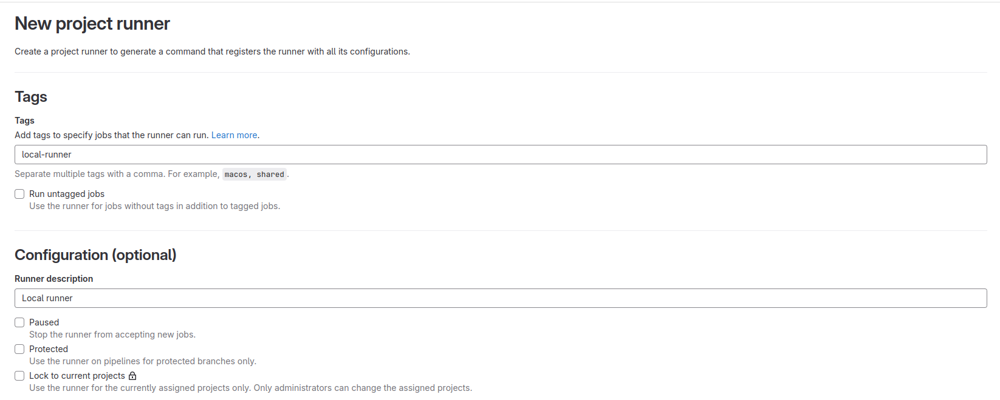
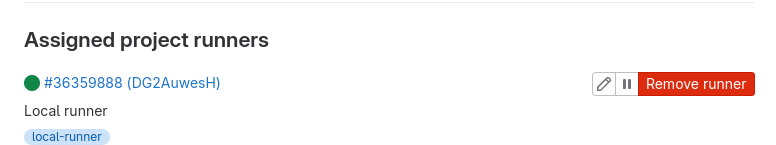
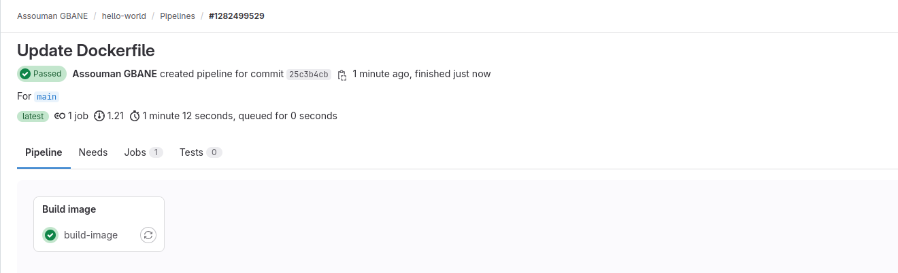
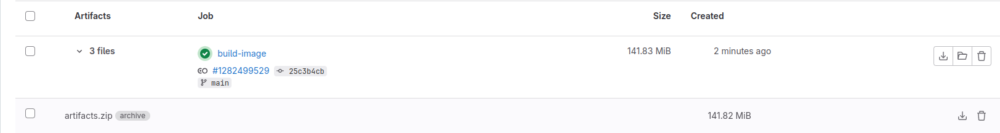

# Lab 1 : BUILD
- Créez un compte sur gitlab.com
- Créez un repository
- Cloner l'application 
- Créez votre fichier .gitlab-ci.yml
- Créez un job qui va permettre de builder l'image à partir du Dockerfile
- Lancez votre pipeline et validez que l'image est bien buildée

Les besoins
Pour mon travail j'aurai besoin de :

mettre en place un runner privé à partir d'un conteneur Docker qui sera chargé d'exécuter le pipeline

## Plan de travail
La réalisation de ce tp se fera en deux étapes qui sont:

- **1 - Mise en place du runner**
- **2 - Mise en place de la CI pour le Build**

## Mise en place du runner
L'installation du runner se fera localement sur ma machine, Docker étant déjà installé, on peut passer à l'installation du runner dont la documentation se trouve [ici](https://docs.gitlab.com/runner/register)

- création du répertoire de base

Ce répertoire sera monté en `Bind-mount` dans le runner

```
sudo mkdir -p /data/gitlab/runner
```
- **création du conteneur**

```
docker run -d --name gitlab-runner --restart always \
-v /var/run/docker.sock:/var/run/docker.sock \
-v /data/gitlab/runner:/etc/gitlab-runner \
gitlab/gitlab-runner:latest
```
- **Résultat**
```
gitlab/gitlab-runner:latest
Unable to find image 'gitlab/gitlab-runner:latest' locally
latest: Pulling from gitlab/gitlab-runner
d4c3c94e5e10: Pull complete 
402a07e4c4cc: Pull complete 
a9537d6ecfc7: Pull complete 
Digest: sha256:911b6b49538b6bed2e4fce04688febd78824f6ed42fe4d5746284a914b5e0eff
Status: Downloaded newer image for gitlab/gitlab-runner:latest
20367d4e295d80f0c22125c0f0878c3e8f74ef497998818a7cf82a4ec7e0fd64
```
- **Vérification du conteneur**
```
gbane@dev-ops:~/gitlab-runner$ docker ps
CONTAINER ID   IMAGE                         COMMAND                  CREATED          STATUS          PORTS     NAMES
20367d4e295d   gitlab/gitlab-runner:latest   "/usr/bin/dumb-init …"   24 minutes ago   Up 24 minutes             gitlab-runner
```
Maintenant que le runner est créé il faut le lié à gitlab pour qu'il puisse être utilisé comme runner. Pour cela il faut suivre les étapes suivantes:
- se rendre à `Settings => CI/CD => Runners` et cliquer sur `New project runner`.
- Récupérer et exporter le token après avoir fournir les informations requises.
- procéder à l'enrégistrement du runner.


```
export TOKEN=le token
```
- **Enrégistremnt du runner**

```
docker run --rm -v /data/gitlab/runner/:/etc/gitlab-runner gitlab/gitlab-runner register \
  --non-interactive \
  --executor "docker" \
  --docker-image docker:dind \
  --url "https://gitlab.com/" \
  --registration-token $TOKEN \
  --description "local runner" \
  --tag-list "local-runner" \
  --run-untagged="true" \
  --locked="false" \
  --access-level="not_protected" \
  --docker-privileged \
  --docker-volumes '/var/run/docker.sock:/var/run/docker.sock'
```
- **Résultat**

```
Runtime platform                                    arch=amd64 os=linux pid=7 revision=535ced5f version=16.11.1
Running in system-mode.                            
                                                   
WARNING: You have specified an authentication token in the legacy parameter --registration-token. This has triggered the 'legacy-compatible registration process' which has resulted in the following command line parameters being ignored: --locked, --access-level, --run-untagged, --maximum-timeout, --paused, --tag-list, and --maintenance-note. For more information, see https://docs.gitlab.com/ee/ci/runners/new_creation_workflow.html#changes-to-the-gitlab-runner-register-command-syntaxThese parameters and the legacy-compatible registration process will be removed in GitLab Runner 18.0.  
Verifying runner... is valid                        runner= runner-id
Runner registered successfully. Feel free to start it, but if it's running already the config should be automatically reloaded!
 
Configuration (with the authentication token) was saved in "/etc/gitlab-runner/config.toml" 
```


>NB: Pour pourvoir utiliser notre il faut au préalable désactiver la shared-runner sur gitlab.

## Mise en place de la CI 
- **Clonage de le l'application**
```
$ git clone https://github.com/eazytrainingfr/alpinehelloworld.git
```
- **création du fichier .gitlab-ci.yml**

Le fichier `.gitlab-ci.yml` définit les scripts qui doivent être exécutés pendant le pipeline CI/CD et leur planification

```
$ touch alpinehelloworld/.gitlab-ci.yml
```
- **édition du fichier**

```
image: docker:latest
services:
  - name: docker:dind
    alias: docker

stages:
  - Build image
  
build-image:
  stage: Build image
  script:
    - docker build -t alpinehelloworld .
    - docker save alpinehelloworld > alpinehelloworld.tar
  artifacts:
    paths:
      - alpinehelloworld.tar
```

**Description**

- `image: docker:latest` : l'image qui servira d'environnement de build
- `services` : dind Docker-in-docker permettra de lancer des commandes docker à l'intérieur de l'iamge
- `stages` : les différentes étapes
- `artifacts` : Le composant de l'application produit lors du build




