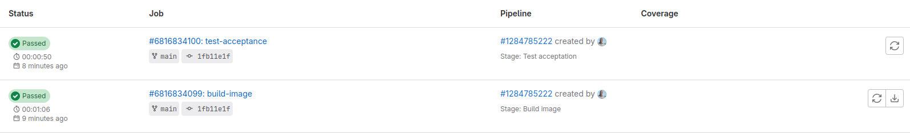
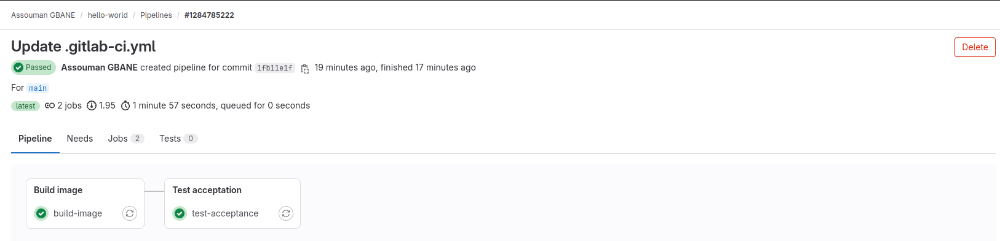

# LAB 2 : Test d'acceptance
- Modifiez le pipeline précédent afin de rajouter un job de teste de l'image à l'aide de curl
- Tester avec curl si le site contient bien « Hello world ! »
- Utiliser la notion d'artefact pour permettre à l'image d'etre Utilisée par les autres Stages

## Mise en place du stage de teste
- **Les stages du pipeline**
```
stages:
  - Build image
  - Test acceptation
```
- **Le stage de teste**
```
image: docker:latest
services:
  - name: docker:dind
    alias: docker

stages:
  - Build image
  - Test acceptation

build-image:
  stage: Build image
  script:
    - docker build -t alpinehelloworld .
    - docker save alpinehelloworld > alpinehelloworld.tar
  artifacts:
    paths:
      - alpinehelloworld.tar

test-acceptation:
  stage: Test acceptation
  before_script:
    - apk add --no-cache curl
  script:
    - docker load -i alpinehelloworld.tar
    - docker stop webapp || true && docker rm -rf webapp || true
    - docker rmi alpinehelloworld -f
    - docker run --name webapp -d  -p 8000:5000 -e PORT=5000 alpinehelloworld
    - export CONTAINER_IP=$(docker inspect -f '{{range.NetworkSettings.Networks}}{{. IPAddress}}{{end}}' webapp)
    - curl "http://$CONTAINER_IP:5000" | grep -q "Hello world" 
    - sleep 5
    - docker stop webapp || true && docker rm webapp || true
```
**Description**
- `before_script`: Permet d'installer curl avant l'exécution des scripts
- `docker load -i alpinehelloworld.tar` : Permet de charger l'image buildée dans le précédent stage
- `CONTAINER_IP`: Récupère l'adresse ip du conteneur et l'exporte en variable d'environnement

---

---
